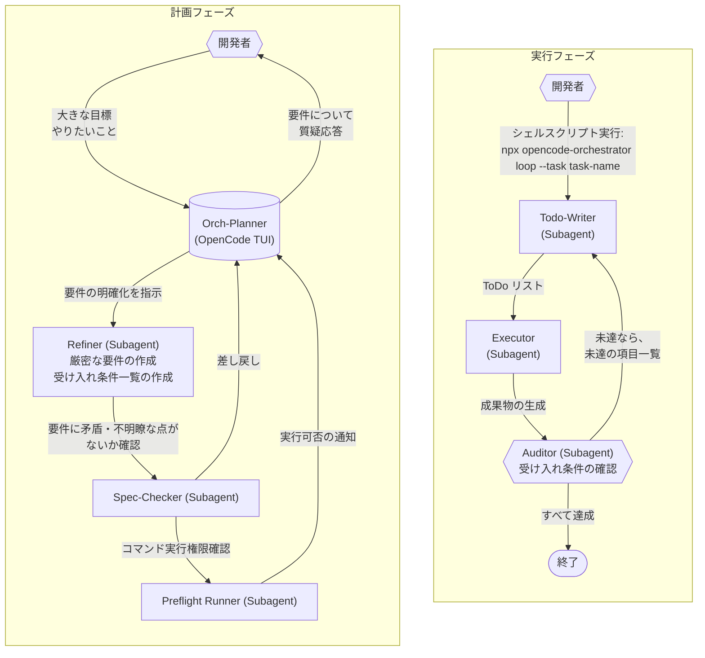

# OpenCode Orchestrator Plugin

[](https://github.com/ZenkakuHiragana/opencode-orchestrator/actions/workflows/coverage.yml)

> [!NOTE]
> ものすごく AI 臭い README だけど、それもそのはず 99% AI 製。
> あんまり真面目に開発する気がないので許してほしい。

このリポジトリは、OpenCode 用のマルチエージェント・オーケストレータを
npm プラグインおよび CLI アプリケーションとして提供するためのコードと
エージェント定義をまとめたものです。

「1 つの大きな開発ストーリー」を、Refiner/Todo-Writer/Executor/Auditor などの
エージェントに分担させて自動で前進させるための、制御ロジックと状態管理を担当します。

## 背景

OpenCode + GPT 系モデルで長期の計画を要するタスクをさせると、
必ずその途中で終わらせて「次は～」と言ってくる現象があります。

予め要件を決めておけば特に方針変更することもないのでひたすら「続けて」というのですが、
だんだん嫌になってきたので自動的にひたすら「続けて」を連打するスクリプトを作ったのがこのプラグインの始まりでした。

## 全体像

このマルチエージェント・オーケストレーターは計画と実行の2段階に分けて使います。

1. OpenCode TUI で計画を立てましょう。すると計画の内容が
   `acceptance-index.json` / `spec.md` / `command-policy.json` に保存されます。
   - 保存先は `$XDG_STATE_HOME/opencode/orchestrator/<task-name>/state` です。
   - デフォルトでは、`~/.local/state/opencode/orchestrator/<task-name>/state` です。
3. エージェントが実行可能だと返答してきたら、別のターミナルで `npx opencode-orchestrator loop --task <task-name>` を実行します。
   - 具体的なコマンドはエージェントが全文を見せてくれるので、コピペで OK です。
   - 計画フェーズが未完了のままでは実行フェーズへ進めません。計画実行に必要なコマンドを `opencode.json` で許可しましょう。
   - ~~最初からなんでも許可しておいても OK です。~~
4. 実行フェーズに入ると、Orchestrator CLI は `todo.json`、`status.json`、`logs/` 配下の step ログ、  
   Auditor の結果を自動更新しながら Todo-Writer / Executor / Auditor を順番に回します。

---



---

### ✅ セットアップフロー

LLM に対しては、次のような指示を 1 行で渡すだけで、自動的にセットアップ〜確認まで進められます。

```text
このリポジトリで @zenorg/opencode-orchestrator を使えるように設定し、README.md に書かれているクイックスタートに従って最小限の動作確認まで実施してください。
```

以下、導入手順です。

> [!NOTE]
> **LLM 向けの説明**
>
> LLM が導入作業を代替する場合はグローバルインストール、
> もしくはローカルインストールのどちらにするのかユーザーの選択を確認してください。
> OpenCode TUI で作業している場合は `question` ツールを使ってユーザーに質問してください。

1. **パッケージのインストール**
   - グローバル インストール: `npm install -g @zenorg/opencode-orchestrator`
   - ローカル インストール: `npm install @zenorg/opencode-orchestrator`

2. **OpenCode の設定ファイル `opencode.json` の作成・更新**

   以下に示すパスに OpenCode の設定ファイルがあるか確認します。
   - グローバル設定（`~/.config/opencode/opencode.json`）
   - ローカル設定（`./opencode.json`）

   OpenCode の設定がない場合は、次の最小構成を作成します。

   ```jsonc
   {
     "$schema": "https://opencode.ai/config.json",
     "plugins": ["@zenorg/opencode-orchestrator"],
     "permission": {
       "bash": {
         "*": "ask",
       },
     },
   }
   ```

   すでに `opencode.json` が存在する場合は、`plugins` 配列に `"@zenorg/opencode-orchestrator"` を 1 要素として追加してください。

3. **OpenCode から Orchestrator を有効化**

   OpenCode を再起動すると有効化されます。Tab でエージェントを切り替えて **Orch-Planner** エージェントが見えることを確認してください。

4. **大まかな使い方**

### CLI リファレンス（抜粋）

## 設定

### `permission.orchestrator`

`opencode.json` に（勝手に）フィールドを追加することで設定を変更することを可能にしています。~~たぶん良くない設計です。~~
`Build` などの組み込みエージェントが「積極的に使ってよいサブエージェント」として認識するサブエージェントの設定です。
デフォルトでは、orchestrator エージェントの `description` はクリアされ、`Build` などの組み込み
エージェントから「積極的に使ってよいサブエージェント」として認識されにくくなっています。

個別にエージェントごとの可視状態を制御するには、`permission.orchestrator` に
エージェント名と権限（`"allow"` / `"deny"` など）のマップを指定します。 `"ask"` は `"deny"` と同等の効果を持ちます。

```json
{
  "permission": {
    "orchestrator": {
      "orch-local-investigator": "allow",
      "orch-public-researcher": "deny"
    }
  }
}
```

| エージェント名キーの有無 / 値  | 挙動                                                   |
| ------------------------------ | ------------------------------------------------------ |
| キーが存在しない（デフォルト） | `"deny"` と同じ                                        |
| `"allow"`                      | `Build` など他のエージェントから見える                 |
| `"deny"`, `"ask"`              | 実行フェーズで呼び出される内部エージェントのみ利用する |

## CLI: `opencode-orchestrator`

現在の CLI には次のサブコマンドがあります。

- `list`: 利用可能なタスク一覧を表示
- `loop`: 指定したタスクの実行ループを開始
- `clear`: 内部状態のクリア
  - `--proposals`: 実行フェーズで発生した問題を解決する提案を無視して消去する
  - Orch-Planner に解決を依頼しないで、手動で（強引に）解決状態にするためのコマンド

### `loop`: 実行ループの開始

長いストーリーを自動で回すエントリポイントが `loop` サブコマンドです。

```sh
npx opencode-orchestrator loop --task my-task-key \
  "このタスクの高レベルなゴール (省略時は spec.md などから自動補完されます)"
```

主なオプション:

- `--task <name>` (必須): ストーリーを識別するタスクキー
- `--continue`: `last_session_id` を使って直近のセッションを継続
- `--session <ses_...>`: 既存セッション ID を明示してループを開始
- `--max-loop N`: 最大ステップ数 (デフォルト 100)
- `--max-restarts M`: 安全装置誤爆時の再起動上限 (デフォルト 20)
- `--commit`: ループ完了時に自動的にコミットをする
- `--file/-f <path>`: 各ステップの `opencode run` に添付する追加ファイル

実行フェーズでは、次の順でコマンドが呼び出されます。

1. (必要に応じて) Todo-Writer ステップ: `opencode run --command orch-todo-write ...`
2. Executor ステップ: `opencode run --command orch-exec ...`
3. Auditor ステップ: `opencode run --command orch-audit --format json ...`
   - Auditor が `done: true` を返した時点でループ終了
   - `--commit` 指定時は、完了後に追加の executor ステップを使って `autocommit` ツール経由のコミットを依頼

各コマンドがどのエージェントを起動し、どのツールを内部的に使うかの詳細は
[`agent-roles.md`](./agent-roles.md) を参照してください。コマンド名 → エージェント名の対応は
`src/orchestrator-commands.ts` に定義されています。

### `list`: タスク一覧の表示

Refiner フェーズで作成された orchestrator state から、利用可能なタスクを一覧表示します。

```sh
npx opencode-orchestrator list
```

典型的な出力例 (テキストモード):

```text
my-task         loop_status=ready_for_loop    summary=API エンドポイント追加
large-refactor  loop_status=needs_refinement  summary=大規模リファクタリング
```

主なオプション:

- `--json`: タスク一覧を JSON 配列で出力
- `--proposals`: `--task` で指定したタスクの実行フェーズで発生している問題を解決するための提案の一覧。
  - タスクの実行フェーズで問題が発生した時に何を解決するべきかの提案（proposal）が書き込まれます。
  - Orch-Planner はこの記録を自律的に読み取ることができます。人間がこの出力をコピーする必要はありません。

JSON 出力例:

```json
[
  {
    "task": "my-task",
    "rootDir": "~/.local/state/opencode/orchestrator/my-task",
    "stateDir": "~/.local/state/opencode/orchestrator/my-task/state",
    "loop_status": "ready_for_loop",
    "summary": "API エンドポイント追加"
  }
]
```

`loop_status` は `command-policy.json` の `summary.loop_status` から取得されます。

## ディレクトリ構成

- `src/`
  - TypeScript 実装本体
- `agents/*.md`
  - 各 orchestrator エージェントのプロンプト本文 (frontmatter なし)
- `commands/*.md`
  - `orch-todo-write` / `orch-exec` / `orch-audit` などのコマンドテンプレート本文
- `AGENTS.md`
  - このリポジトリで作業する AI エージェント向けの詳細ルール

## 依存関係とビルド

- Node.js 18+ / npm
- OpenCode CLI (`opencode` コマンド)

```sh
npm install
npm run build   # dist/cli.js, dist/index.js を生成
```

`package.json` で `bin` として `opencode-orchestrator` が公開されます。

### command-policy ゲート

実行開始前に、CLI は必ず次のファイルをチェックします。

- `getOrchestratorStateDir(<task-name>)/command-policy.json`

このファイルは、Refiner が用意した受け入れ条件とコマンド候補に対して
Spec-Checker / Preflight-Runner が出した結果を、Planner が集約して作る
「どのコマンドを使ってよいか」のポリシーです。主なルール:

- ファイルが存在しない場合は **エラーで即終了**
- `commands[].usage === "must_exec"` なのに `availability !== "available"` なコマンドが 1 つでもある場合、ループ開始を拒否
- `summary.loop_status` が
  - `needs_refinement` : 受け入れ条件やコマンドがまだ曖昧
  - `blocked_by_environment` : 必須コマンドが環境に存在しない
    などの場合もループ開始を拒否

これにより、Executor が「存在しないテストコマンド」や
「使ってはいけないビルドコマンド」を勝手に叩かないようにガードしています。

### セッションとログ

タスクキー `my-task` の場合、状態とログは次に保存されます。

- 状態: `$(getOrchestratorBaseDir)/my-task/state`
  - `acceptance-index.json` : Refiner が管理する受け入れ条件一覧
  - `spec.md` : 高レベルなゴール / 制約 / 終了条件 / 受け入れ条件の解釈指針
  - `status.json` : Executor / Auditor の進捗スナップショット、Todo-Writer 向けの正規化された再計画要求 (`replan_request`)、および protocol/failsafe 用の `failure_budget`
  - `todo.json` : Todo-Writer エージェントによるタスクリスト
  - `command-policy.json` : spec-check + preflight によるコマンド可否
- ログ: `$(getOrchestratorBaseDir)/my-task/logs`
  - `orch_step_000.txt` : 初回 `orch-todo-write` 出力
  - `orch_step_XXX.txt` : 各ステップ executor の出力
  - `audit_step_XXX.jsonl` : auditor の JSON ストリーム
  - `audit_step_XXX.json` : auditor の最終 JSON (必要に応じて別処理で生成)
  - `orchestrator_session_*.json` : `opencode export` で保存したセッション全体
  - `session_*.id` / `last_session_id` : セッション ID

これらのログから、あとから `opencode tui --session <id>` でセッションにアタッチしたり、
`jq` で auditor の結果を集計したりできます。

## エージェント構成

詳細な実装は `agent-roles.md` に詳細がありますが、概要だけまとめます。

- Orch-Planner (`orch-planner`)
  - モード: `primary`
  - 役割: Refiner / Spec-Checker / Preflight-Runner をまとめて呼び出す計画フェーズ担当 (TUI からの窓口)。
  - `npx opencode-orchestrator loop` 実行前に、TUI でこのエージェントと対話します。
  - acceptance-index と spec.md の作成・更新は Refiner に委譲し、
    自身は主に Spec-Checker / Preflight-CLI の結果をまとめて「どのコマンドが必須で、どの程度環境が整っているか」を人間に説明します。
  - Preflight は permission / availability の確認用に行う操作を指します。
  - 必要に応じて `npx opencode-orchestrator loop ...` で実行ループを開始できます。
- Refiner (`orch-refiner`)
  - 高レベルなゴールをテスト可能な受け入れ条件に分解する Requirements Refiner です。
  - `acceptance-index.json`, `spec.md`, `command-policy.json` を管理し、コマンド定義も含めたメタデータを提案します。
  - `spec.md` に、タスクのゴール / non-goals / 制約 / 成果物 / 終了条件 / 受け入れ条件の解釈方針などを日本語でまとめた仕様を書き出します。
- Spec-Checker (`orch-spec-checker`)
  - acceptance-index と spec.md、および command-policy.json を解析し、仕様やコマンド定義の抜け・構造的問題・受け入れ条件との対応関係の不整合を指摘する解析専用サブエージェントです。
  - `issues[]` に acceptance-index / spec / command-policy それぞれに対する指摘を JSON として出力しますが、ファイルの編集・更新は行いません (完全 read-only)。
- ~~Preflight-Runner (`orch-preflight-runner`)~~
  - ~~`command-policy.json.commands[]` に定義されたコマンドに対して非対話モードで実行し、実行権限の確認をする~~
  - 現在は LLM を使わずに権限確認処理を実装しています。
- Todo-Writer (`orch-todo-writer`)
  - Refiner が作った acceptance-index と spec.md を読み、Executor が実行しやすい todo リストに分解する計画専任エージェントです。
  - `$XDG_STATE_HOME/opencode/orchestrator/<task-name>/state/todo.json` に「derived planning cache」として todo 構造を書き出します。
  - 各 todo を 15-30 分程度の bounded unit に保ち、大きすぎる場合は垂直スライスで分割します。
    主作業面・橋渡し作業・期待証拠・完了境界を decision-complete な形で明示し、`execution_contract` メタデータで Auditor 向けの証拠境界を状態から追跡可能にします。
  - `orch_todo_read` / `orch_todo_write` ツールを使ってタスクリストを管理します。
- Executor (`orch-executor`)
  - 実装とローカル検証専任エージェントです。Todo-Writer/Refiner が用意した acceptance-index や todo を読み取り、コード・テスト・ドキュメント変更とローカル検証を担当します。
  - `bash` / `glob` / `grep` / `read` / `apply_patch` などを利用
  - 各 step の最終出力では `STEP_INTENT` / `STEP_VERIFY` / `STEP_AUDIT` を必須で返し、`STEP_INTENT` / `STEP_VERIFY` の ID はカンマ区切り (`R1,R2` または `R1, R2`) で出力します。
  - `STEP_VERIFY: ready` は command IDs・明示的に再確認した diffs・no-command 理由のうち少なくとも 1 つの根拠を要求します。根拠なしで `STEP_AUDIT: ready` をemit しても Auditor は起動されません。
  - 主要 requirement の作業では requirement-to-diff トレーサビリティ（`requirement_traceability`）を残します。
  - ルーティングは軽量・逐次的です。サブエージェントの委譲は広範な読み取り専用の探索に限定し、並列実行や外部キューは前提としません。
- Auditor (`orch-auditor`)
  - 完了判定専用の外部監査役
  - Git の読み取り系コマンドとログのみを参照し、1 行 JSON (`{ done, requirements[] }`) を返す
  - Orchestrator CLI では `STEP_AUDIT: ready` に加えて `STEP_VERIFY: ready` が揃った step でのみ起動されます。
  - ファイルを変更せず、`git status` / `git diff` / ログファイルなどを参照して `done` と `requirements[{id, passed, reason}]` を返します。

## ツール / コマンド

### `autocommit` ツール

ファイル: `src/autocommit.ts`

- 目的: OpenCode から安全に Git コミットを作るためのラッパ
- 用途: `opencode-orchestrator loop --commit` 引数を指定した時、実行フェーズ完了時に自動的にコミットする。
- 特徴:
  - **明示的に指示しない限り利用されません。**（そのようにプロンプトを指定している、という意味です）
    - 「use autocommit」などと指示するとそれまでの変更内容からもっともらしいコミットメッセージでコミットします。
  - conventional commits (`type: message`) 形式でコミットメッセージを組み立て
  - 引数 `files[]` に指定されたパスのみをコミット対象にする
  - `.env`, `node_modules/`, `dist/`, `*.log` など典型的な秘匿情報・ビルド成果物はブラックリストで自動除外
  - 任意引数 `details` を指定すると、subject 行とは別にコミットボディを追加の `-m` として渡し、
    conventional commits の subject + body 形式でより詳細な説明を付与できる

Executor からは「どのファイルをどの type でコミットするか」を明示的に決めさせる設計になっています。

### `preflight-cli` ツール

ファイル: `src/preflight-cli.ts`

- 目的: Refiner が提案したコマンド群を、CLI 側から安全に試す
- 用途: 計画フェーズにて、最小のコマンド実行権限で遂行可能であることを確認する。
- 特徴: OpenCode SDK で取得できる opencode.json の内容からコマンド列のパターンマッチングを行うことで判定する。
