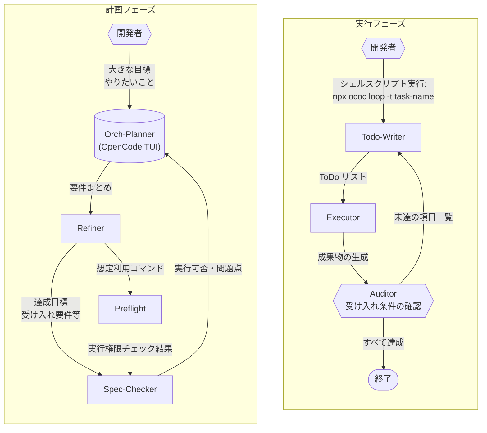

# OpenCode Orchestrator Plugin

[](https://github.com/ZenkakuHiragana/opencode-orchestrator/actions/workflows/ci.yml)
[](https://github.com/ZenkakuHiragana/opencode-orchestrator/actions/workflows/ci.yml)

OpenCode で長めの開発タスクを進めるための、マルチエージェント・オーケストレータです。

このリポジトリには、次の 2 つが入っています。

- OpenCode に組み込むプラグイン
- 実行フェーズを回す CLI `ococ`

アプリケーション本体のロジックを持つリポジトリではなく、
**「計画 → 実装 → 監査」を安定して回すための制御レイヤー**を提供するリポジトリです。

## これは何をしてくれるのか

大きめのタスクを 1 回の指示で最後まで進めたいとき、LLM は途中で止まりやすくなります。
このオーケストレータは、その問題を次の分担で扱います。

- Planner が計画を固める
- Refiner / Spec-Checker / Preflight が実行条件を整える
- Todo-Writer / Executor / Auditor が実行フェーズを回す

詳しい内部仕様を最初から全部読む必要はありません。
まずはこの README で導入方法と使い方を把握し、必要になったら詳細資料を参照してください。

- エージェントの役割分担: [`agent-roles.md`](./agent-roles.md)
- このリポジトリで作業するエージェント向けルール: [`AGENTS.md`](./AGENTS.md)

## こんなときに向いています

- 1 回では終わらない実装タスクを OpenCode に任せたい
- 要件整理と実装を分けて、安全にループさせたい
- 監査役を別エージェントにして、完了判定を厳しめにしたい
- 実行ログや状態ファイルを残しながら進めたい

## 全体の流れ

使い方は大きく **計画フェーズ** と **実行フェーズ** の 2 段階です。

1. OpenCode TUI で `Orch-Planner` と対話し、タスクの前提とゴールを固めます。
2. Refiner / Spec-Checker / Preflight が、要件・仕様・実行可能性を整えます。
3. Planner が「このタスクは実行に進める」と判断したら、CLI で実行フェーズを開始します。
4. 実行フェーズでは Todo-Writer → Executor → Auditor を繰り返し、完了まで進めます。


```mermaid
flowchart LR
  subgraph Planning["計画フェーズ"]
    direction TB
    Dev{{"開発者"}} --"大きな目標<br/>やりたいこと"-->
    Planner[("Orch-Planner<br/>(OpenCode TUI)")] --"要件まとめ"-->
    Refiner["Refiner"]
    Refiner --"達成目標<br/>受け入れ要件等"-->
    Spec-Checker["Spec-Checker"]
    Refiner --"想定利用コマンド"--> Preflight["Preflight"]
    Preflight --"実行権限チェック結果"-->
    Spec-Checker --"実行可否・問題点"--> Planner
  end

  subgraph Execution["実行フェーズ"]
    direction TB
     Dev2{{"開発者"}} --"シェルスクリプト実行:<br/>npx ococ loop -t task-name"-->
    TodoWriter["Todo-Writer"]
    --"ToDo リスト"-->
    Executor["Executor"]
    --"成果物の生成"-->
    Auditor{{"Auditor<br/>受け入れ条件の確認"}}
    --"未達の項目一覧"--> TodoWriter
    Auditor --"すべて達成"--> End(["終了"])
  end

  Planning ~~~ Execution
```

### 計画フェーズでやっていること

- ゴール、制約、非ゴールを整理する
- 受け入れ条件と実行方針を固める
- 実行に必要なコマンドが使えるか確認する

ここで準備が整っていない限り、実行フェーズには進みません。

内部では state ファイルを使って管理していますが、使い始める段階では
「計画が固まってから実行に進む」と理解しておけば十分です。

### 実行フェーズでやっていること

- Todo-Writer が実行しやすい単位に todo を分解する
- Executor がコード・テスト・ドキュメントを更新する
- Auditor が受け入れ条件を満たしたか確認する

## クイックスタート

日常的な利用では、短い CLI 名の `ococ` を使う前提で読むのが分かりやすいです。
長い名前の `opencode-orchestrator` も互換エイリアスとして使えます。

### 前提条件

導入前に、次を用意してください。

- Node.js 18 以上
- npm
- OpenCode が使える環境

セットアップや実行で詰まったら、まず `ococ doctor` を試すと切り分けしやすくなります。

### 1. OpenCode にプラグインを登録する

```bash
# グローバルに有効化する
npx @zenorg/opencode-orchestrator install -g

# カレントディレクトリだけで有効化する
npx @zenorg/opencode-orchestrator install
```

### 2. CLI をインストールする

```bash
npm install -g @zenorg/opencode-orchestrator
ococ --help
```

### 3. OpenCode を再起動する

OpenCode を再起動し、Tab でエージェントを切り替えて
`Orch-Planner` が見えることを確認してください。

### 4. Planner と対話して計画を固める

まずは OpenCode TUI で `Orch-Planner` を使います。
ここで要件、制約、必要コマンド、実行可否が整理されます。

実行前に、計画フェーズと実行フェーズで必要なコマンドを
`opencode.json` の権限設定で許可してください。

最初に迷いやすい点は次の 2 つです。

- どのサブエージェントを他エージェントから見せるか
- どのシェルコマンドを許可するか

前者は `permission.orchestrator`、後者は `permission.bash` で調整します。
必要なコマンドはタスクごとに異なるため、まずは Planner の案内に従ってください。

### 5. 実行フェーズを始める

通常は高レベルコマンドの `run` を使います。

ここで使う `<task-key>` は、Planner が扱っているタスク名と同じものです。
迷ったときは `ococ list` や `ococ status --task <task-key>` で確認してください。

```bash
ococ run --task <task-key>
```

低レベル API を直接使いたい場合は `loop` でも始められます。

```bash
ococ loop --task <task-key>
```

### LLM にセットアップを任せる場合

OpenCode に次のプロンプトを渡すと、導入作業の入口として使えます。

```text
read & follow https://www.npmjs.com/package/@zenorg/opencode-orchestrator
```

> [!NOTE]
> LLM が導入作業を代替する場合は、グローバルインストールにするか、
> カレントディレクトリ限定にするかをユーザーに確認してください。
> OpenCode TUI で作業している場合は `question` ツールを使う想定です。

## よく使うコマンド

### 高レベルコマンド

普段はこちらを使えば十分です。

| コマンド                    | 用途                                           |
| --------------------------- | ---------------------------------------------- |
| `ococ run --task <task>`    | 実行可能なタスクを開始する                     |
| `ococ resume`               | 直近のタスクやセッションを再開する             |
| `ococ status --task <task>` | 現在の状況と次のアクションを確認する           |
| `ococ fix --task <task>`    | 詰まっている理由と次の一手を確認する           |
| `ococ doctor`               | Node / npm / OpenCode / state まわりを診断する |
| `ococ completion bash`      | 補完スクリプトを出力する                       |

### 低レベルコマンド

細かく制御したいときは、従来どおりの低レベルコマンドも使えます。

- `ococ loop --task <task>`
- `ococ list`
- `ococ clear`
- `ococ install`

## シェル補完

### bash

一時的に有効化する:

```bash
eval "$(ococ completion bash)"
```

常時有効化する:

```bash
echo 'eval "$(ococ completion bash)"' >> ~/.bashrc
```

### PowerShell

一時的に有効化する:

```powershell
ococ completion powershell | Out-String | Invoke-Expression
```

常時有効化する:

```powershell
'ococ completion powershell | Out-String | Invoke-Expression' |
  Out-File -FilePath $PROFILE -Encoding UTF8 -Append
```

## 設定

最初に意識すべき設定は、次の 2 つです。

- `permission.orchestrator`: 他エージェントから見える orchestrator サブエージェントの制御
- `permission.bash`: 計画フェーズと実行フェーズで使うコマンドの許可

`permission.bash` で何を許可すべきかはタスクごとに変わります。
README では固定の推奨セットは示さず、Planner が提示する内容に合わせて設定する前提にしています。

### `permission.orchestrator`

`permission.orchestrator` は、他エージェントから見える orchestrator サブエージェントを制御する設定です。
デフォルトでは見えにくくしてあり、必要なものだけ明示的に `allow` します。

```json
{
  "permission": {
    "orchestrator": {
      "orch-local-investigator": "allow",
      "orch-public-researcher": "deny"
    }
  }
}
```

| 設定値        | 挙動                                 |
| ------------- | ------------------------------------ |
| キーなし      | `deny` と同じ                        |
| `allow`       | `Build` など他エージェントから見える |
| `deny`, `ask` | 実行フェーズ内部でのみ利用する       |

### `command-policy` について

実行フェーズに進む前に、CLI は `command-policy.json` を確認します。
ここで見ているのは、主に次の 2 点です。

- 必須コマンドが実行できるか
- Planner が loop 開始可能と判断しているか

要するに、**実行前の安全確認**です。

## `loop` の主なオプション

`loop` を直接使う場合によく使うオプションです。

| オプション         | 意味                               |
| ------------------ | ---------------------------------- |
| `--task`, `-t`     | タスクキーを指定する               |
| `--continue`       | `last_session_id` から継続する     |
| `--session <id>`   | セッション ID を明示して継続する   |
| `--max-loop N`     | 最大ステップ数を指定する           |
| `--max-restarts N` | 安全装置による再起動上限を指定する |
| `--file <path>`    | 各 step に追加ファイルを添付する   |
| `--commit`         | 完了後にコミットを作る             |

### 危険なオプション

次の 2 つは上級者向けです。

- `--dangerously-skip-command-policy`
  - `command-policy.json` の実行制約を無視します。
  - Executor は OpenCode の `permission.bash` の範囲で自由にコマンドを組み立てます。
- `--bwrap-skip-command-policy`
  - 上記に加え、Linux では Executor を Bubblewrap サンドボックス内で動かします。

## 状態ファイルとログ

ここから先は、運用やトラブルシュートで必要になる情報です。
まず使い始めたいだけなら、いったん読み飛ばしても構いません。

状態ファイルは、通常次のディレクトリに保存されます。

- `$XDG_STATE_HOME/opencode/orchestrator/<task-name>/state`
- デフォルトでは `~/.local/state/opencode/orchestrator/<task-name>/state`

よく見るファイルは次のとおりです。

| ファイル                | 役割                                      |
| ----------------------- | ----------------------------------------- |
| `discovery-packet.md`   | Planner が管理する計画の元メモ            |
| `acceptance-index.json` | Refiner が管理する受け入れ条件一覧        |
| `spec.md`               | ゴール、制約、非ゴール、検証観点の要約    |
| `command-policy.json`   | 実行前ゲートの基準になるファイル          |
| `todo.json`             | Todo-Writer が作る正式な todo 一覧        |
| `status.json`           | Executor / Auditor の進捗スナップショット |
| `proposals.json`        | 再計画が必要な提案キュー                  |

ログは次のディレクトリに保存されます。

- `$XDG_STATE_HOME/opencode/orchestrator/<task-name>/logs`

代表的なログ:

- `orch_step_XXX.txt`
- `audit_step_XXX.jsonl`
- `todowriter_step_XXX.txt`
- `orchestrator_session_*.json`

## エージェント構成

README では役割だけを短く載せます。詳しくは [`agent-roles.md`](./agent-roles.md) を見てください。

| エージェント              | 役割                                  |
| ------------------------- | ------------------------------------- |
| `orch-planner`            | 計画フェーズの窓口                    |
| `orch-refiner`            | 要件と仕様を canonical state に正規化 |
| `orch-spec-checker`       | 要件の抜けや矛盾を監査                |
| `orch-todo-writer`        | 実行しやすい todo に分解              |
| `orch-executor`           | 実装とローカル検証                    |
| `orch-auditor`            | 完了判定                              |
| `orch-local-investigator` | リポジトリ内の調査                    |
| `orch-public-researcher`  | 外部の公開情報の調査                  |

## 開発

このリポジトリ自体を開発する場合の基本コマンドです。

```bash
npm install
npm run format
npm run build
npm test
```

ビルド成果物:

- `dist/index.js` — プラグイン本体
- `dist/cli.js` — CLI 本体

## 関連ドキュメント

- [`agent-roles.md`](./agent-roles.md)
  - エージェントとコマンドの役割分担を詳しく見たいとき
- [`AGENTS.md`](./AGENTS.md)
  - このリポジトリで作業するエージェント向けの開発ルールを見たいとき
- `docs/`
  - ADR や設計メモを見たいとき

README は「使い始めるための入口」に絞っています。
内部仕様や state の詳細まで追いたい場合は、上の資料を参照してください。
