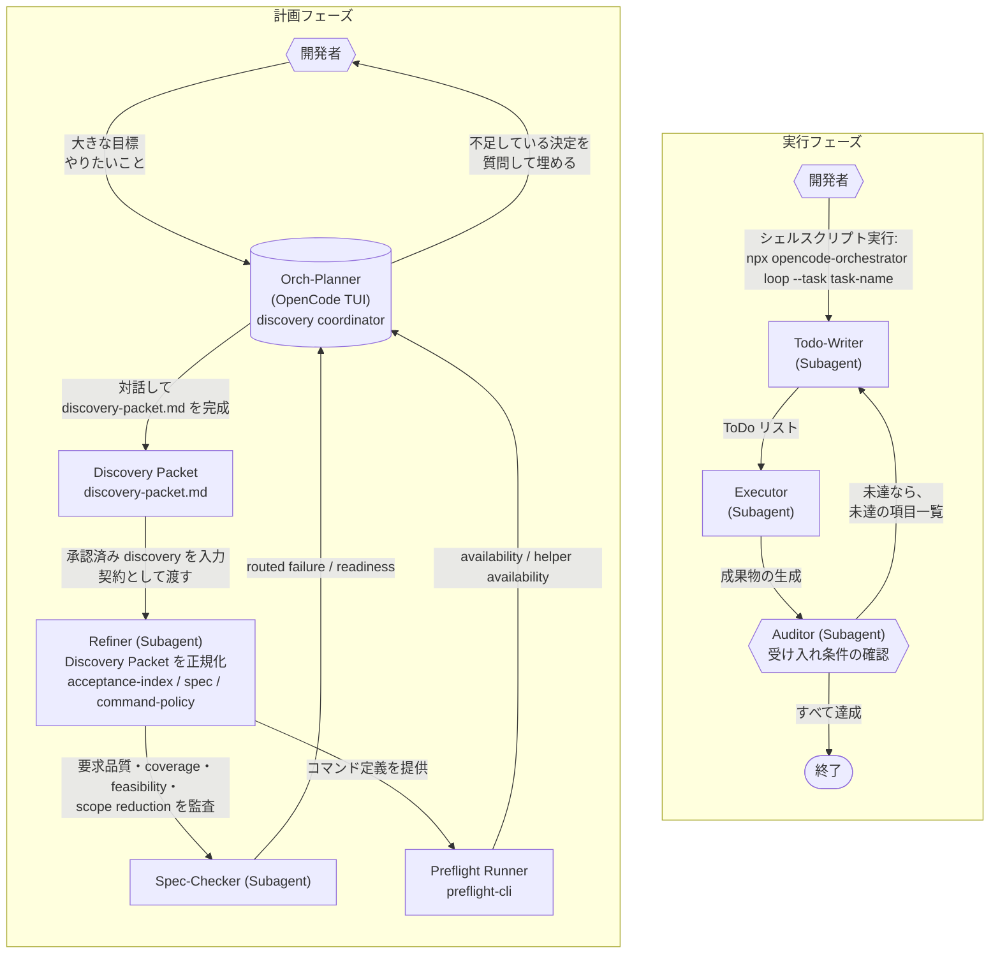

# OpenCode Orchestrator Plugin

[](https://github.com/ZenkakuHiragana/opencode-orchestrator/actions/workflows/ci.yml)
[](https://github.com/ZenkakuHiragana/opencode-orchestrator/actions/workflows/ci.yml)

このリポジトリは、OpenCode 用のマルチエージェント・オーケストレータを
npm プラグインおよび CLI アプリケーションとして提供するためのコードと
エージェント定義をまとめたものです。

「1 つの大きな開発ストーリー」を、Planner/Refiner/Todo-Writer/Executor/Auditor
などの
エージェントに分担させて自動で前進させるための、制御ロジックと状態管理を担当します。

## 背景

OpenCode + GPT 系モデルで長期の計画を要するタスクをさせると、
必ずその途中で終わらせて「次は～」と言ってくる現象があります。

予め要件を決めておけば特に方針変更することもないのでひたすら「続けて」というのですが、
だんだん嫌になってきたので自動的にひたすら「続けて」を連打するスクリプトを作ってたらこうなりました。

## 全体像

このマルチエージェント・オーケストレーターは計画と実行の2段階に分けて使います。

1. OpenCode TUI で Planner と対話し、まず `discovery-packet.md` を完成させます。
   その後 Refiner が Discovery Packet を正規化して
   `acceptance-index.json` / `spec.md` / `command-policy.json.commands[]` を作成し、
   Preflight が `commands[].availability` と `summary.available_helper_commands` を埋め、Planner が Spec-Checker の `status` / `feasible_for_loop` と routed failures も合わせて `command-policy.json.summary` の strict readiness を最終化してから、ループ投入可否を判断します。
   - 保存先は `$XDG_STATE_HOME/opencode/orchestrator/<task-name>/state` です。
   - デフォルトでは、`~/.local/state/opencode/orchestrator/<task-name>/state` です。
2. エージェントが実行可能だと返答してきたら、別のターミナルで `npx opencode-orchestrator loop --task <task-name>` を実行します。
   - 具体的なコマンドはエージェントが全文を見せてくれるので、コピペで OK です。
   - 計画フェーズが未完了のままでは実行フェーズへ進めません。計画実行に必要なコマンドを `opencode.json` で許可しましょう。
   - ~~最初からなんでも許可しておいても OK です。~~
3. 実行フェーズに入ると、Orchestrator CLI は `todo.json`、`status.json`、`logs/` 配下の step ログ、  
    Auditor の結果を自動更新しながら Todo-Writer / Executor / Auditor を順番に回します。
   - planning gate は引き続き `command-policy.json.summary` を参照し、`status.json` は進捗スナップショットとして扱います。
   - `command-policy.json.summary.loop_status` が loop 開始可否の strict readiness gate であり、Preflight はこの field を更新せず、Planner のみが最終化します。

---


```mermaid
flowchart LR
  subgraph Planning["計画フェーズ"]
    direction TB
    Dev{{"開発者"}} --"大きな目標<br/>やりたいこと"-->
    Planner[("Orch-Planner<br/>(OpenCode TUI)<br/>discovery coordinator")]
    Planner --"対話して<br/>discovery-packet.md を完成"--> Packet["Discovery Packet<br/>discovery-packet.md"]
    Planner --"不足している決定を<br/>質問して埋める"---> Dev
    Packet --"承認済み discovery を入力契約として渡す"-->
    Refiner["Refiner (Subagent)<br/>Discovery Packet を正規化<br/>acceptance-index / spec / command-policy"]
    Refiner --"要求品質・coverage・feasibility・<br/>scope reduction を監査"-->
    Spec-Checker["Spec-Checker (Subagent)"]
    Refiner --"コマンド定義を提供"--> Preflight-Runner["Preflight Runner<br/>preflight-cli"]
    Spec-Checker --"routed failure / readiness"--> Planner
    Preflight-Runner --"availability / helper availability"--> Planner
  end

  subgraph Execution["実行フェーズ"]
    direction TB
     Dev2{{"開発者"}} --"シェルスクリプト実行:<br/>npx opencode-orchestrator loop --task task-name"-->
    TodoWriter["Todo-Writer<br/>(Subagent)"]
    --"ToDo リスト"-->
    Executor["Executor<br/>(Subagent)"]
    --"成果物の生成"-->
    Auditor{{"Auditor (Subagent)<br/>受け入れ条件の確認"}}
    --"未達なら、<br/>未達の項目一覧"--> TodoWriter
    Auditor --"すべて達成"--> End(["終了"])
  end

  Planning ~~~ Execution
```

---

### ✅ セットアップフロー

OpenCode に次のプロンプトを送信するとこれを読んでセットアップしてくれると思います。

```text
read & follow https://www.npmjs.com/package/@zenorg/opencode-orchestrator
```

> [!NOTE]
> **LLM 向けの説明**
>
> LLM が導入作業を代替する場合はグローバルインストール、
> もしくはローカルインストールのどちらにするのかユーザーの選択を確認してください。
> OpenCode TUI で作業している場合は `question` ツールを使ってユーザーに質問してください。

1. OpenCode へのプラグインの登録

```bash
# グローバルに有効化する場合
# $XDG_CONFIG_HOME/.config/opencode/opencode.json に追記するだけ
npx @zenorg/opencode-orchestrator install -g

# カレントディレクトリでだけ有効化する場合
# ./opencode.json に追記するだけ
npx @zenorg/opencode-orchestrator install
```

実行フェーズ用 CLI のインストール

```bash
npm install -g @zenorg/opencode-orchestrator
# メインのエントリポイント (短いエイリアス)
ococ --help
# 互換エイリアス (長い名前の CLI)
opencode-orchestrator --help
```

3. **OpenCode から Orchestrator を有効化**

OpenCode を再起動すると有効化されます。Tab でエージェントを切り替えて **Orch-Planner** エージェントが見えることを確認してください。

## 設定

### `permission.orchestrator`

`opencode.json` に（勝手に）フィールドを追加することで設定を変更することを可能にしています。~~たぶん良くない設計です。~~
`Build` などの組み込みエージェントが「積極的に使ってよいサブエージェント」として認識するサブエージェントの設定です。
デフォルトでは、orchestrator エージェントの `description` はクリアされ、`Build` などの組み込み
エージェントから「積極的に使ってよいサブエージェント」として認識されにくくなっています。

個別にエージェントごとの可視状態を制御するには、`permission.orchestrator` に
エージェント名と権限（`"allow"` / `"deny"` など）のマップを指定します。 `"ask"` は `"deny"` と同等の効果を持ちます。

```json
{
  "permission": {
    "orchestrator": {
      "orch-local-investigator": "allow",
      "orch-public-researcher": "deny"
    }
  }
}
```

| エージェント名キーの有無 / 値  | 挙動                                                   |
| ------------------------------ | ------------------------------------------------------ |
| キーが存在しない（デフォルト） | `"deny"` と同じ                                        |
| `"allow"`                      | `Build` など他のエージェントから見える                 |
| `"deny"`, `"ask"`              | 実行フェーズで呼び出される内部エージェントのみ利用する |

## CLI: `ococ` / `opencode-orchestrator`

実行フェーズ用の CLI には、短い名前の `ococ` (OpenCode Orchestrator CLI) と、
互換エイリアスである `opencode-orchestrator` の 2 つがあります。
日常的な利用では `ococ` を使う前提で設計されています。

```sh
# 代表的な使い方 (短いエイリアス)
ococ --help
ococ run -t my-task-key
ococ status -t my-task-key
ococ doctor
ococ fix -t my-task-key
ococ completion bash
```

長い名前の CLI (`opencode-orchestrator`) も、既存スクリプトや
ドキュメントとの互換性のために引き続き利用できますが、この README
では `ococ` を前提に説明します。

### 高レベルサブコマンド (推奨)

日常的な運用では、次の高レベルサブコマンドを使うことを想定しています。

- `run`: 受け入れ条件や command-policy が整ったタスクの実行を開始します。
  - 例: `ococ run --task cli-ux-i18n-and-completion`
  - `-t` は `--task` の短縮エイリアスです。
- `resume`: 直近で作業していたタスクやセッションを再開します。
  - 例: `ococ resume`
- `status`: 特定タスクの現在の状況と、次に何をすればよいかを要約して表示します。
  - 例: `ococ status --task cli-ux-i18n-and-completion`
- `doctor`: Node/npm/opencode/state ディレクトリ/ネットワークなど、環境全体の診断を実行します。
  - 例: `ococ doctor`
- `fix`: 特定タスクがなぜ進まないのかを読み取り、次に実行すべきコマンド (status/doctor/fix/run など) を説明します。
  - 例: `ococ fix --task cli-ux-i18n-and-completion`
  - 直近の監査失敗、open proposal、計画ブロック、環境ブロック、実行可能状態、完了状態を読み分けて案内します。
  - 代表的な失敗理由や未達要件があれば、それも合わせて表示します。
- `completion`: bash / PowerShell 用の補完設定を生成します。
  - 例: `ococ completion bash`

これらのコマンドは、`loop` サブコマンドのような低レベル API を直接
叩かなくても、実行ループの開始/再開や状況確認・診断が行えるようにする
ためのフロントドアです。

### シェル補完 (bash / PowerShell)

タブ補完を有効にすると、サブコマンド名や `--task` オプション、既知タスク名
などを補完できるようになります。`ococ completion <shell>` は、補完用の
スクリプトを標準出力に書き出します。

#### bash の場合

現在のシェルで一時的に有効化する:

```bash
eval "$(ococ completion bash)"
```

毎回自動で読み込む場合は、`~/.bashrc` などに追記します:

```bash
echo 'eval "$(ococ completion bash)"' >> ~/.bashrc
```

この設定を有効にしたあと、`ococ` や `opencode-orchestrator` を入力してから
`Tab` キーを押すと、サブコマンドや `--task` オプション、既知タスク名などが
候補として表示されます。

#### PowerShell の場合

現在のセッションで一時的に有効化する:

```powershell
ococ completion powershell | Out-String | Invoke-Expression
```

毎回自動で読み込む場合は、PowerShell プロファイルに追記します:

```powershell
'ococ completion powershell | Out-String | Invoke-Expression' |
  Out-File -FilePath $PROFILE -Encoding UTF8 -Append
```

設定後は、PowerShell でも `ococ` や `opencode-orchestrator` に対して
サブコマンド・オプション・タスク名の補完が利用できるようになります。

### 低レベルサブコマンド (上級者向け)

高レベルサブコマンドの裏側では、従来どおりの低レベルサブコマンドも利用
されています。必要に応じて直接呼び出すこともできますが、通常は
`ococ run` / `ococ status` / `ococ doctor` / `ococ fix` を使うことを推奨します。

- `list`: 利用可能なタスク一覧を表示
- `loop`: 指定したタスクの実行ループを開始
- `clear`: 内部状態のクリア
  - `--proposals`: すべての open な提案を一括で解消する
  - `--resolve <proposal-id>`: 指定した提案 1 件を解消する
  - `--dismiss <proposal-id>`: 指定した提案 1 件を却下する
- `install`: OpenCode の設定ファイルを編集し、このプラグインを登録する
  - `-g`: ホームディレクトリのグローバル設定に登録する

### `loop`: 実行ループの開始 (低レベル API)

高レベルコマンドよりも細かく挙動を制御したい場合は、
`loop` を直接呼び出すこともできます。

```sh
npx ococ loop -t my-task-key
```

主なオプション:

- `--task/-t <name>` (必須): ストーリーを識別するタスクキー
- `--continue`: `last_session_id` を使って直近のセッションを継続
- `--session <ses_...>`: 既存セッション ID を明示してループを開始
- `--max-loop N`: 最大ステップ数 (デフォルト 100)
- `--max-restarts M`: 安全装置誤爆時の再起動上限 (デフォルト 20)
- `--commit`: ループ完了時に自動的にコミットをする
- `--file/-f <path>`: 各ステップの `opencode run` に添付する追加ファイル
- `--dangerously-skip-command-policy`:
  - 計画フェーズで決めた「許可コマンドリスト」を無視し、Executor が
    OpenCode 標準の permission.bash 設定の範囲で自由にコマンドを
    組み立てるようにします。
  - Todo-Writer もそれを加味した計画を立てるようになります。
- `--bwrap-skip-command-policy` (Linux のみ有効):
  - 上記に加え、Executor エージェントの `opencode run` を Bubblewrap サンドボックスで実行します。
  - `--bwrap-arg <arg>` を繰り返して追加引数を渡せます。単純なフラグであれば `--bwrap-skip-command-policy --unshare-net ...` のような bare option も受け付けます。
  - 例:
    ```sh
    npx ococ loop -t my-task --bwrap-skip-command-policy --unshare-net
    npx ococ loop -t my-task --bwrap-skip-command-policy --bwrap-arg --bind --bwrap-arg /src --bwrap-arg /src
    ```
  - 次の引数を指定して Bubblewrap をセットアップしています。
    > ```bash
    > bwrap \
    >   --ro-bind /usr /usr \
    >   --ro-bind /bin /bin \
    >   --ro-bind /sbin /sbin \
    >   --ro-bind /lib /lib \
    >   --ro-bind /lib64 /lib64 \
    >   --ro-bind /etc /etc \
    >   --ro-bind "$XDG_CONFIG_HOME/opencode" "$XDG_CONFIG_HOME/opencode" \
    >   --ro-bind "$HOME/.npmrc" "$HOME/.npmrc" \
    >   --bind "$XDG_CACHE_HOME/opencode" "$XDG_CACHE_HOME/opencode" \
    >   --bind "$XDG_SHARE_HOME/opencode" "$XDG_SHARE_HOME/opencode" \
    >   --bind "$XDG_STATE_HOME/opencode" "$XDG_STATE_HOME/opencode" \
    >   --bind "$HOME/.opencode" "$HOME/.opencode" \
    >   --bind "$PWD" "$PWD" \
    >   --dev /dev \
    >   --proc /proc \
    >   --tmpfs /tmp \
    >   --chdir "$PWD" \
    >   --unshare-pid \
    >   --die-with-parent \
    >   --new-session \
    >   -- opencode run --command orch-exec --session sed_**** --file ... -- "internal prompt"
    > ```

実行フェーズでは、次の順でコマンドが呼び出されます。

1. (必要に応じて) Todo-Writer ステップ: `opencode run --command orch-todo-write ...`
2. Executor ステップ: `opencode run --command orch-exec ...`
3. Auditor ステップ: `opencode run --command orch-audit --format json ...`
   - 通常ステップでは、Executor が `STEP_AUDIT: ready` で申告した要件 subset のみを incremental audit します
   - incremental audit が通った場合だけ、ループ終了直前に full acceptance set を対象とした final full audit を追加で実行します
   - final full audit が `done: true` を返した時点でループ終了
   - `--commit` 指定時は、完了後に追加の executor ステップを使って `autocommit` ツール経由のコミットを依頼

各コマンドがどのエージェントを起動し、どのツールを内部的に使うかの詳細は
[`agent-roles.md`](./agent-roles.md) を参照してください。コマンド名 → エージェント名の対応は
`src/orchestrator-commands.ts` に定義されています。

### `list`: タスク一覧の表示

Refiner フェーズで作成された orchestrator state から、利用可能なタスクを一覧表示します。

```sh
npx opencode-orchestrator list
```

典型的な出力例 (テキストモード):

```text
my-task         実行可能                  API エンドポイント追加
large-refactor  計画の見直しが必要        大きめのリファクタリング
```

主なオプション:

- `--json`: タスク一覧を JSON 配列で出力
  -- `--proposals`: `--task` で指定したタスクの実行フェーズで発生している問題を解決するための提案の一覧。
  - 提案ごとの `status` / `priority` / `kind` / `source` などがテキストまたは JSON で表示されます。
  - `--open` を付けると open な提案だけに絞れます。
  - Orch-Planner はこの記録を自律的に読み取ることができます。人間がこの出力をコピーする必要はありません。

JSON 出力例 (開発者向け):

```json
[
  {
    "task": "my-task",
    "rootDir": "~/.local/state/opencode/orchestrator/my-task",
    "stateDir": "~/.local/state/opencode/orchestrator/my-task/state",
    "loop_status": "ready_for_loop",
    "summary": "API エンドポイント追加"
  }
]
```

`loop_status` は `command-policy.json` の `summary.loop_status` から取得されます。

## ディレクトリ構成

- `src/`
  - TypeScript 実装本体
- `agents/*.md`
  - 各 orchestrator エージェントのプロンプト本文 (frontmatter なし)
- `commands/*.md`
  - `orch-todo-write` / `orch-exec` / `orch-audit` などのコマンドテンプレート本文
- `resources/*.json`
  - 内部で情報伝達に使用するJSONファイルのスキーマ定義など

## 依存関係とビルド

- Node.js 18+ / npm
- OpenCode CLI (`opencode` コマンド)

```sh
npm install
npm run build   # dist/cli.js, dist/index.js を生成
```

`package.json` で `bin` として `opencode-orchestrator`, `ococ` が公開されます。

### command-policy ゲート

実行開始前に、CLI は必ず次のファイルをチェックします。

- `getOrchestratorStateDir(<task-name>)/command-policy.json`

このファイルは、Refiner が用意した受け入れ条件とコマンド候補に対して
Preflight-Runner が `commands[].availability` と `summary.available_helper_commands` を埋め、Planner が strict readiness を `summary` に最終化して作る
「どのコマンドを使ってよいか」のポリシーです。主なルール:

- ファイルが存在しない場合は **エラーで即終了**
- `commands[].usage === "must_exec"` なのに `availability !== "available"` なコマンドが 1 つでもある場合、ループ開始を拒否
- `summary.loop_status` が
  - `needs_refinement` : 受け入れ条件やコマンドがまだ曖昧
  - `blocked_by_environment` : 必須コマンドが環境に存在しない
    などの場合もループ開始を拒否
- `summary.loop_status` は strict readiness gate であり、Preflight はこの field を更新せず、Planner のみが最終化する
- Spec-Checker の `severity` は説明用であり、機械 gate は `status` / `feasible_for_loop` / routed failures を使う

これにより、Executor が「存在しないテストコマンド」や
「使ってはいけないビルドコマンド」を勝手に叩かないようにガードしています。

### セッションとログ

タスクキー `my-task` の場合、状態とログは次に保存されます。

- 状態: `$(getOrchestratorBaseDir)/my-task/state`
  - `discovery-packet.md` : Planner が管理する discovery 契約
  - `acceptance-index.json` : Refiner が管理する受け入れ条件一覧
  - `spec.md` : 高レベルなゴール / 制約 / explicit non-goals / validation view / 受け入れ条件の解釈指針
  - `status.json` : Executor / Auditor の進捗スナップショット、`last_executor_step` / `last_auditor_report` / `failure_budget`
    - planning gate のソース・オブ・トゥルースではありません。
    - Planner が触るとしても、proposal 解消や failure-budget cleanup に伴う保守的な maintenance 更新に限ります。
  - `proposals.json` : Executor / Auditor / Todo-Writer などの loop actors が populate する live proposal queue。open な提案は解決または却下されるまで残り、次回の replanning に再投入されます
    - Planner は replanning 時に解決済み提案のクリア／調整を行えます。
  - `todo.json` : Todo-Writer エージェントによるタスクリスト
- `command-policy.json` : planning gate のソース・オブ・トゥルース。Refiner が `commands[]` を定義し、Preflight が availability / helper availability を更新し、Planner が `summary` の strict readiness を最終化
- ログ: `$(getOrchestratorBaseDir)/my-task/logs`
  - `orch_step_000.txt` : 初回 `orch-todo-write` 出力
  - `orch_step_XXX.txt` : 各ステップ executor の出力
  - `audit_step_XXX.jsonl` : auditor の JSON ストリーム
  - `audit_step_XXX.json` : auditor の最終 JSON (必要に応じて別処理で生成)
  - `orchestrator_session_*.json` : `opencode export` で保存したセッション全体
  - `session_*.id` / `last_session_id` : セッション ID

これらのログから、あとから `opencode tui --session <id>` でセッションにアタッチしたり、
`jq` で auditor の結果を集計したりできます。

## エージェント構成

詳細な実装は `agent-roles.md` にありますが、概要だけまとめます。

- Orch-Planner (`orch-planner`)
  - モード: `primary`
  - 役割: TUI からの窓口として discovery を主導し、`discovery-packet.md` を管理したうえで Refiner / Spec-Checker / preflight-cli をまとめて呼び出す計画フェーズ担当です。
  - `npx opencode-orchestrator loop` 実行前に、TUI でこのエージェントと対話します。
  - current task に効く意思決定を人間と閉じてから Refiner に渡し、未承認の scope reduction や先送りを防ぎます。
  - `acceptance-index.json` / `spec.md` / `command-policy.json.commands[]` の canonical owner ではなく、主に discovery・preflight・Spec-Checker の結果を集約し、`command-policy.json.summary.loop_status` を strict readiness gate として最終化して人間に説明します。
  - Preflight は permission / availability の確認用に毎回行う操作で、`must_exec` コマンドの blocking 判定に必要な `commands[].availability` と helper availability の更新だけを担います。Preflight 単独では readiness を最終化しません。
  - 必要に応じて `npx opencode-orchestrator loop ...` で実行ループを開始できます。
- Refiner (`orch-refiner`)
  - Planner が完成させた Discovery Packet を契約入力として受け取り、要件をテスト可能な canonical state に正規化する Requirements Refiner です。
  - `acceptance-index.json`, `spec.md`, `command-policy.json.commands[]` を管理し、Planner が後続で strict readiness を確定できる初期 summary も用意します。
  - `spec.md` には、タスクのゴール / resolved decisions / explicit non-goals / constraints / validation view / 終了条件などを、現在の user-facing 会話と同じ自然言語で書き出します。
- Spec-Checker (`orch-spec-checker`)
  - acceptance-index / spec / command-policy.json と `discovery-packet.md` の整合を解析し、暗黙要件の明示化漏れも含めて要求品質・coverage・feasibility・unauthorized scope reduction を監査する解析専用サブエージェントです。
  - 要件の品質判断では、ISO/IEEE 29148 系の well-formedness 特性や tacit knowledge の明示化に関する既知の知見を踏まえて、unambiguous / complete / consistent / traceable / verifiable であることを重視します。
  - `issues[]` に `failure_type`, `return_to`, `missing_trace`, `validation_gap` を含む routed failure を JSON で出力しますが、ファイルの編集・更新は行いません (完全 read-only)。`severity` は説明優先度専用であり、機械 gate は top-level `status` / `feasible_for_loop` と routed failure を使います。
- Todo-Writer (`orch-todo-writer`)
  - Refiner が作った acceptance-index と spec.md を読み、Executor が実行しやすい todo リストに分解する計画専任エージェントです。
  - `$XDG_STATE_HOME/opencode/orchestrator/<task-name>/state/todo.json` に「derived planning cache」として todo 構造を書き出します。
  - 通常は `planner_add_todos` / `planner_update_todos` による増分 replanning を行い、`planner_replace_canonical` は todo cache の欠損・破損・大きな要件変更で既存構造が救えないときだけ使います。
  - 各 todo を 15-30 分程度の bounded unit に保ち、大きすぎる場合は垂直スライスで分割します。
    主作業面・橋渡し作業・期待証拠・完了境界を decision-complete な形で明示し、`execution_contract` メタデータで Auditor 向けの証拠境界を状態から追跡可能にします。
  - その際、`command-policy.json` を根拠に `command_ids` を選び、`spec.md` の `Resolved decisions` / `Explicit non-goals` / `Validation view` を execution-facing contract として参照します。
  - `orch_todo_read` / `orch_todo_write` ツールを使ってタスクリストを管理します。
- Executor (`orch-executor`)
  - 実装とローカル検証専任エージェントです。Todo-Writer/Refiner が用意した acceptance-index や todo を読み取り、コード・テスト・ドキュメント変更とローカル検証を担当します。
  - `bash` / `glob` / `grep` / `read` / `apply_patch` などを利用
  - 各 step の最終出力では `STEP_INTENT` / `STEP_VERIFY` / `STEP_AUDIT` を必須で返し、`STEP_INTENT` / `STEP_VERIFY` の ID はカンマ区切り (`R1,R2` または `R1, R2`) で出力します。
  - `STEP_VERIFY: ready` は command IDs・明示的に再確認した diffs・no-command 理由のうち少なくとも 1 つの根拠を要求します。根拠なしで `STEP_AUDIT: ready` をemit しても Auditor は起動されません。
  - 主要 requirement の作業では requirement-to-diff トレーサビリティ（`requirement_traceability`）を残します。
  - `status.json.last_auditor_report.requirements[]` に `failure_kind` / `evidence_gaps` がある場合は、それを次 step の structured remediation input として扱います。
  - ルーティングは軽量・逐次的です。サブエージェントの委譲は広範な読み取り専用の探索に限定し、並列実行や外部キューは前提としません。
- Auditor (`orch-auditor`)
  - subset 監査と最終完了監査を担う外部監査役
  - `read` / `glob` / `grep` と Git の読み取り系コマンドだけを使い、1 行 JSON (`{ audit_mode, scope_requirement_ids, done, requirements[] }`) を返す
  - Orchestrator CLI では `STEP_AUDIT: ready` に加えて `STEP_VERIFY: ready` が揃った step でのみ起動されます。
  - 通常ステップでは Executor が申告した要件 subset に対して `incremental` 監査を行い、subset が通った場合だけ終了直前に `final_full` 監査を行います。
  - ファイルを変更せず、`git status` / `git diff` / ログファイルなどを参照して `done` と `requirements[{id, passed, reason, failure_kind?, evidence_gaps?}]` を返します。
- Local Investigator (`orch-local-investigator`)
  - リポジトリ内だけを対象に、関数・型・設定キー・ファイルの所在と関係を調べる読み取り専用サブエージェントです。
  - Refiner / Executor が、広めのローカル探索を自分で何度もやり直す代わりに使います。
- Public Researcher (`orch-public-researcher`)
  - ライブラリ仕様、既知の挙動差、設定方法など、リポジトリ外の公開情報を一次ソース付きで調べる non-interactive な調査サブエージェントです。
  - Refiner / Executor が public facts を推測で済ませず、source-cited な形で取り込むときに使います。

## ツール / コマンド

### `autocommit` ツール

ファイル: `src/autocommit.ts`

- 目的: OpenCode から安全に Git コミットを作るためのラッパ
- 用途: `opencode-orchestrator loop --commit` 引数を指定した時、実行フェーズ完了時に自動的にコミットする。
- 特徴:
  - **明示的に指示しない限り利用されません。**（そのようにプロンプトを指定している、という意味です）
    - 「use autocommit」などと指示するとそれまでの変更内容からもっともらしいコミットメッセージでコミットします。
  - conventional commits (`type: message`) 形式でコミットメッセージを組み立て
  - 引数 `files[]` に指定されたパスのみをコミット対象にする
  - `.env`, `node_modules/`, `dist/`, `*.log` など典型的な秘匿情報・ビルド成果物はブラックリストで自動除外
  - 任意引数 `details` を指定すると、subject 行とは別にコミットボディを追加の `-m` として渡し、
    conventional commits の subject + body 形式でより詳細な説明を付与できる

Executor からは「どのファイルをどの type でコミットするか」を明示的に決めさせる設計になっています。

### `preflight-cli` ツール

ファイル: `src/preflight-cli.ts`

- 目的: Refiner が提案したコマンド群を、CLI 側から安全に試す
- 用途: 計画フェーズにて、最小のコマンド実行権限で遂行可能であることを確認する。
- 特徴: OpenCode SDK で取得できる opencode.json の内容からコマンド列のパターンマッチングを行うことで判定する。
