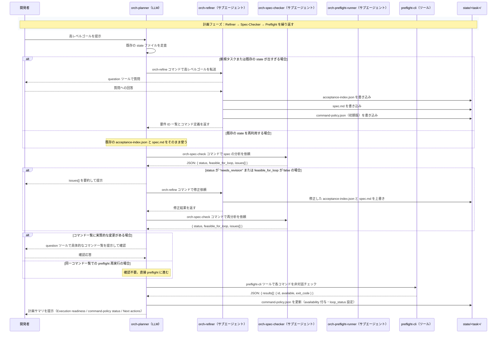
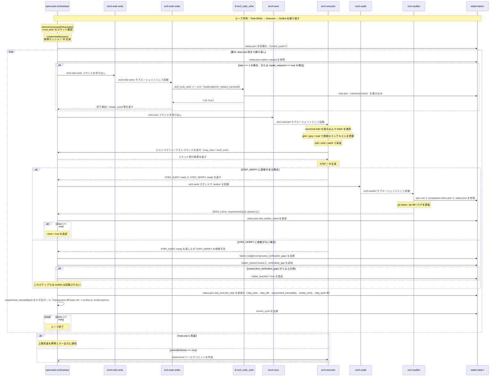

# Orchestrator エージェントの役割整理

このドキュメントは、`opencode-orchestrator` パイプラインに登場する各エージェント／コマンドの役割と、
それぞれが主に「どのファイルを読むか / 書くか / どんな出力を返すか」を、実際のプロンプトとコード
（`agents/*.md`, `commands/*.md`, `src/orchestrator-*.ts` など）に基づいてまとめたものです。

## 1. 共通コンポーネント

- `agents/*.md`
  - 各エージェントのシステムプロンプト（役割・制約・入出力契約）を英語で定義。
  - 各エージェントの出力言語ポリシーや、どのパスに対して読み書き可能かを明示。
- `commands/orch-*.md`
  - Orchestrator 関連 CLI コマンドの「ユーザープロンプト」部分を定義。
  - `opencode run --command orch-...` 実行時に `$ARGUMENTS` が差し込まれる。
- `src/orchestrator-agents.ts`
  - `orchestratorAgents` テーブルで、各エージェントの使用可能ツールと permission を定義。
- `src/orchestrator-commands.ts`
  - `orchestratorCommands` テーブルで、`orch-todo-write` などのコマンド名 → 紐づくエージェント名
    （`agent` フィールド）を定義。
- **コマンドとツールの違い（重要）**
  - **カスタムコマンド**（例：`orch-todo-write`、`orch-exec`）は OpenCode が `opencode run --command <name>` で起動する単位。引数の概念はなく、プロンプトは `commands/<name>.md` に定義される。
  - **カスタムツール**（例：`orch_todo_write`、`preflight-cli`）は LLM が内部的に呼び出す関数で、`mode` などの引数を持つ。実装は `src/orchestrator-*.ts` に定義される。
  - Orchestrator-loop は**コマンド**を呼び出してサブエージェントを起動し、サブエージェントが**ツール**を内部的に使って state を読み書きする。
- `src/orchestrator-loop.ts`
  - 実際の Orchestrator ループ本体。`orch-todo-write`/`orch-exec`/`orch-audit` を組み合わせて
    セッションを進行し、`state/` 配下の各種ファイルを読み書きする。
- Orchestrator 共通状態ディレクトリ
  - ベースパス: `$XDG_STATE_HOME/opencode/orchestrator/<task-name>/state/`
  - 主なファイル:
    - `acceptance-index.json` … 要件一覧（Refiner オーナー）
    - `spec.md` … ストーリ仕様（Refiner オーナー／日本語）
    - `todo.json` … Todo-Writer が生成する canonical todo 一覧
    - `command-policy.json` … Planner が合成するコマンドポリシー
    - `status.json` … `orchestrator-loop` が更新するループ状態
      - 直近の executor / auditor スナップショットに加えて、
        Todo-Writer が再計画入力として優先参照する `replan_request` を含む。

以下、エージェント／コマンドごとに、(A) 役割, (B) 主な入力ファイル, (C) 主な出力ファイル,
(D) プロンプト上の出力仕様 を整理します。

## 1.5. シーケンス図

> **前提：コマンドとツールの違い**
>
> - **カスタムコマンド**（例：`orch-todo-write`）は OpenCode TUI や Planner（LLM）が `opencode run --command orch-todo-write` で呼び出すもの。引数の概念はない。対応するプロンプトは `commands/orch-todo-write.md`（「plan your tasks\n$ARGUMENTS」のみ）。
> - **カスタムツール**（例：`orch_todo_write`）は LLM が内部的に使うツールで、`mode` などの引数を持つ。対応する実装は `src/orchestrator-todo.ts`。
> - Orchestrator-loop は**コマンド**を呼び出してサブエージェントを起動し、サブエージェントが**ツール**を内部的に使って state を読み書きする。

---

### 1.5.1. TUI 計画フェーズ（Planning Loop）



**図 1.5.1 補足：TUI 計画フェーズのポイント**

- Planner（LLM）は **orch-refine / orch-spec-check / orch-preflight** などの**カスタムコマンド**を呼び出して各サブエージェントを起動する。コマンド自体に引数の概念はない。
- PreflightRunner の呼び出しだけは `preflight-cli` **ツール**経由（非対話実行専用）。
- Refiner / Spec-Checker のサイクルは、`status === "ok"` かつ `feasible_for_loop === true` になるまで何度でも回る。
- `command-policy.json` を更新できるのは、Planner が担当するこのフェーズだけである。

---

### 1.5.2. Executor ループ実行フェーズ（Execution Loop）



**図 1.5.2 補足：Executor ループ実行フェーズのポイント**

コマンド層とツール層の区別：

| 呼び出し元                           | 呼び出し先      | 種類         | 備考                                                        |
| ------------------------------------ | --------------- | ------------ | ----------------------------------------------------------- |
| CLI（orchestrator-loop）             | orch-todo-write | **コマンド** | `runOpencode(["run", "--command", "orch-todo-write", ...])` |
| CLI（orchestrator-loop）             | orch-exec       | **コマンド** | 同上                                                        |
| CLI（orchestrator-loop）             | orch-audit      | **コマンド** | JSON 出力で Auditor を起動                                  |
| orch-todo-writer（サブエージェント） | orch_todo_write | **ツール**   | `mode=planner_replace_canonical`                            |
| orch-executor（サブエージェント）    | orch_todo_write | **ツール**   | `mode=executor_update_statuses`                             |

各ステップで `status.json` に書き込まれる主なデータ:

| フィールド            | 内容                                                                                                               |
| --------------------- | ------------------------------------------------------------------------------------------------------------------ |
| `last_executor_step`  | `step_todo` / `step_diff` / `step_cmd` / `step_intent` / `step_verify` / `step_audit` / `requirement_traceability` |
| `last_auditor_report` | `{ done, requirements[{id, passed, reason}] }`                                                                     |
| `replan_request`      | ブロック事由・失敗種別の正規化されたリスト（Todo-Writer の次パスで参照）                                           |
| `failure_budget`      | verification_gap・audit_failed 等の連続カウント                                                                    |
| `replan_required`     | failure_budget の閾値超過で true                                                                                   |
| `current_cycle`       | ステップ番号（1 始まり）                                                                                           |

`requirement_traceability` は `parseExecutorStepSnapshot()` の中で `buildRequirementDiffTrace()` により `step_todo` / `step_diff` / `step_intent` / `step_audit` から自動導出される。各ステップで Auditor が requirement から代表ファイルへ追跡できる道筋が確保されている。

---

## 2. orch-planner

- 実体
  - エージェント: `orch-planner` (`agents/orch-planner.md`)
  - スラッシュコマンド: なし
  - 計画全体を `orch-planner` が `task=orch-refiner` / `task=orch-spec-checker` を使って主導する
    （エージェント設定は `src/orchestrator-agents.ts` 参照）。

- (A) 役割
  - 高レベルのゴールから、Executor ループ実行前に必要な「オーケストレータ状態」を整備する
    プランニングコーディネータ。
  - `orch-refiner` / `orch-spec-checker` / `orch-preflight-runner` を呼び分けて、
    `acceptance-index.json`, `spec.md`, `command-policy.json`, spec-check レポート、preflight 結果
    などを揃える。
  - `command-policy.json` の `summary.loop_status` と `commands[]` を最終的に更新する唯一の
    エージェント（コマンド定義自体は Refiner の責務）。

- (B) 主な入力（読むファイル）
  - `$XDG_STATE_HOME/opencode/orchestrator/<task>/state/acceptance-index.json`
  - `$XDG_STATE_HOME/opencode/orchestrator/<task>/state/spec.md`
  - `$XDG_STATE_HOME/opencode/orchestrator/<task>/state/command-policy.json`
  - リポジトリ内コード／ドキュメント（必要に応じて `read`/`glob`/`grep`）

- (C) 主な出力（書くファイル）
  - `$XDG_STATE_HOME/opencode/orchestrator/<task>/state/command-policy.json`
    - `summary.loop_status`
    - `commands[]`（Refiner 定義のコマンドに preflight 結果を付与）

- (D) 出力内容（プロンプト上の仕様）
  - 人間向けには、次のようなサマリを短いセクションで返す（`agents/orch-planner.md` 末尾参照）：
    - `Execution readiness`（executor ループを開始して良いか）
    - `command-policy status`（`loop_status` とコマンド可用性の要約）
    - `Required changes`（必要な追加作業）
    - `Next actions`（次に行うべきステップ）
  - 付随する spec-check / preflight 結果は JSON だが、Planner 自身の最終応答は
    上記の箇条書きテキスト。

## 3. orch-refiner / orch-refine

- 実体
  - エージェント: `orch-refiner` (`agents/orch-refiner.md`)
  - スラッシュコマンド: `orch-refine` (`commands/orch-refine.md`)

- (A) 役割
  - 要件の精査エージェント。高レベルゴールを「受け入れ条件付きの要求一覧」に落とし込む。
  - `acceptance-index.json` と `spec.md` を **唯一** 書き換える権限を持つエージェント。
  - 追加で `command-policy.json` 初期版を担当し、
    コマンド ID やテンプレートの単一のソース・オブ・トゥルースになる。
  - `command-policy.json` の `commands[]` に含まれるコマンド定義は Refiner が唯一のオーナーであり、
    Planner や Spec-Checker はこれを読み取り専用で扱う。
  - goal / scope / non-goals / confirmed facts / defaults / プロジェクト指示 (`AGENTS.md` など) を
    別ソースとして明示的に区別し、下流エージェントが要件とデフォルトを混同しないようにする。

- (B) 主な入力
  - 高レベルゴール（CLI 引数 / 添付ファイルで渡される）
  - `$XDG_STATE_HOME/opencode/orchestrator/<task>/state/acceptance-index.json`（既存があれば）
  - `$XDG_STATE_HOME/opencode/orchestrator/<task>/state/spec.md`（既存があれば）
  - `$XDG_STATE_HOME/opencode/orchestrator/<task>/state/command-policy.json`（既存があれば）
  - リポジトリのコード／ドキュメント（`read`/`glob`/`grep`）

- (C) 主な出力
  - `$XDG_STATE_HOME/opencode/orchestrator/<task>/state/acceptance-index.json`
    - `version`, `requirements[]` などの構造化された受け入れ条件（説明文は日本語）。
  - `$XDG_STATE_HOME/opencode/orchestrator/<task>/state/spec.md`
    - タスクのゴール、非ゴール、制約、期待成果物、Done 条件など（日本語）。
  - `$XDG_STATE_HOME/opencode/orchestrator/<task>/state/command-policy.json`
    - 初期の `commands[]` リストを定義。

- (D) 出力内容
  - エージェントの通常応答としては、
    - 受け入れ条件の箇条書き概要
    - 主要な requirement ID と内容
    - 必要コマンド候補（ID, command, role, usage, parameters など）
      を短く説明するテキスト。
  - ファイル内容そのものは JSON / Markdown として state ディレクトリに書き出される。

## 4. orch-spec-checker / orch-spec-check

- 実体
  - エージェント: `orch-spec-checker` (`agents/orch-spec-checker.md`)
  - スラッシュコマンド: `orch-spec-check` (`commands/orch-spec-check.md`)

- (A) 役割
  - 受け入れ仕様と command-policy の構造検査を行う読み取り専用エージェント。
  - acceptance-index / spec / command-policy.json の構造問題・抜け・矛盾を検査し、
    JSON レポートの `issues[]` にコマンド候補の不足・過剰・安全性・テンプレート化の
    観点を含めて返す。
  - 以下の追加観点も検出する:
    - spec.md 内で指示ソース（goal / non-goals / confirmed facts / defaults / プロジェクト指示）
      が曖昧にブレンドされている構造的問題
    - 弱い証拠境界（requirement の完了証明にファイル・コマンド・状態変化の hook がないもの）
    - wrapper script や複合 shell エントリポイントを隠す unsafe なコマンド定義
    - command-policy 変更時の Planner 確認ルールの曖昧さ

- (B) 主な入力
  - `$XDG_STATE_HOME/opencode/orchestrator/<task>/state/acceptance-index.json`
  - `$XDG_STATE_HOME/opencode/orchestrator/<task>/state/spec.md`
  - `$XDG_STATE_HOME/opencode/orchestrator/<task>/state/command-policy.json`
  - 必要に応じてリポジトリ内ファイル（`read`/`glob`/`grep`）

- (C) 主な出力
  - 1 行の JSON オブジェクトのみを標準出力に返す契約。
  - 構造例（実際の仕様より抜粋）:
    - `status`: `"ok"` / `"needs_revision"`
    - `feasible_for_loop`: orchestrator ループに載せられるかのブール値
    - `issues[]`: acceptance-index / spec / command-policy に関する問題一覧（`summary`/`suggested_action` は日本語）

## 5. orch-preflight-runner / orch-preflight

- 実体
  - エージェント: `orch-preflight-runner` (`agents/orch-preflight-runner.md`)
  - スラッシュコマンド: `orch-preflight` (`commands/orch-preflight.md`)
  - Planner からは `preflight-cli` ツール経由で呼び出される。

- (A) 役割
  - Spec-checker などが定義した「候補コマンド」が現在の環境で実行可能か、
    破壊的でない範囲で実際に `bash` 経由で試す。

- (B) 主な入力
  - プロンプト中に JSON として埋め込まれたコマンド一覧:
    - `[ { "id": "cmd-dotnet-test", "command": "dotnet test", "role": "test", "usage": "must_exec" }, ... ]`
  - 各 `command` はテンプレート展開済みの「最終的な 1 行コマンド」。

- (C) 主な出力（ファイル）
  - 自身はファイルを書かない。
  - 出力 JSON は Planner 等が読み取り、必要であれば state ディレクトリに保存。

- (D) 出力内容
  - 1 行の JSON オブジェクトのみ（`agents/orch-preflight-runner.md` 参照）。
  - 構造:
    - `status`: `"ok"` / `"failed"`
    - `results[]`: 各コマンドごとの
      - `id`, `command`, `role`, `usage`
      - `available`（boolean）
      - `exit_code`
      - `stderr_excerpt`（日本語で短い説明）

## 6. orch-todo-writer / orch-todo-write

- 実体
  - エージェント: `orch-todo-writer` (`agents/orch-todo-writer.md`)
  - スラッシュコマンド: `orch-todo-write` (`commands/orch-todo-write.md`)
  - 初回セッション作成やループ内の「プラン更新ステップ」として呼び出される（`src/orchestrator-loop.ts`）。

- (A) 役割
  - Refiner が作成した受け入れ要件から「Executor が実行する Todo」を構造化して作る。
  - Todo は `id` / `summary` / `status` / `related_requirement_ids[]` を持ち、
    acceptance-index 内の要件とのトレーサビリティを確保する。
  - 各 Todo を 15-30 分程度で完了する bounded unit に保ち、
    主作業面・橋渡し作業・期待証拠・完了境界を decision-complete な形で明示する。
  - `execution_contract` メタデータ (`intent`, `expected_evidence`, `command_ids`, `audit_ready_when`)
    を添付することで、Executor と Auditor が todo だけで証拠境界を推測なしに把握できるようにする。
  - 大きい requirement は垂直スライス（実装 + テスト + 関連する docs/prompt を一并に完了境界まで持っていく）
    で分解し、layer-only な巨大 todo バケットを避ける。

- (B) 主な入力
  - `$XDG_STATE_HOME/opencode/orchestrator/<task>/state/acceptance-index.json`
  - `$XDG_STATE_HOME/opencode/orchestrator/<task>/state/spec.md`
  - `$XDG_STATE_HOME/opencode/orchestrator/<task>/state/status.json`
    - `replan_request` がある場合は、Todo-Writer にとっての第一級の再計画入力として扱う。
  - `$XDG_STATE_HOME/opencode/orchestrator/<task>/state/todo.json`
  - `orch_todo_read` ツールからの既存 canonical todo 群

- (C) 主な出力
  - `$XDG_STATE_HOME/opencode/orchestrator/<task>/state/todo.json`
    - `orch_todo_write` ツール (`mode=planner_replace_canonical`) を通じて上書きされる
      canonical todo 一覧。型定義は `src/orchestrator-todo.ts` の `CanonicalTodo`。
  - OpenCode セッション Todo（`todowrite` 経由）
    - UI 表示用に、フィルタ済みの一部 Todo をセッション Todo としてミラーする。

- (D) 出力内容
  - エージェント応答としては、どの要件に対してどのような Todo を追加／更新したかの
    簡潔な説明テキスト。
  - 具体的な Todo 構造は `todo.json` の JSON として保存される。

## 7. orch-executor / orch-exec

- 実体
  - エージェント: `orch-executor` (`agents/orch-executor.md`)
  - スラッシュコマンド: `orch-exec` (`commands/orch-exec.md`)
  - Orchestrator ループ本体から各ステップ毎に呼び出される（`src/orchestrator-loop.ts`）。

- (A) 役割
  - 実装＋検証担当エージェント。コード／テスト／ドキュメントへの具体的な変更と、
    ローカルのビルドやテスト実行を担う。
  - Todo 構造そのものは変更せず、`status` 更新のみを行う。
  - 各 step の開始時に短い preamble と tiny step-local plan を持ち、`STEP_INTENT` は具体的変更単位を名乗る。
  - `STEP_VERIFY: ready` は command IDs・明示的に再確認した diffs・no-command 理由のうち
    少なくとも 1 つを根拠として要求する（根拠なしでは audit handoff できない）。
  - 主要 requirement の作業では requirement-to-diff トレーサビリティを残し、`git status --short` や
    `git diff -- <path>` で Auditor が requirement から代表ファイルへ追跡可能にする。
  - ビルドコマンドやテストコマンドは回帰確認の補助証拠であり、requirement ごとの diff 証拠の代替ではない。
  - ルーティングは軽量・逐次的: 委譲は広範な read-only 探索に使い、実装自体は local で担う。
    並列 executor 分岐や外部キューを前提にした振る舞いは禁止。

- (B) 主な入力
  - `$XDG_STATE_HOME/opencode/orchestrator/<task>/state/acceptance-index.json`
  - `$XDG_STATE_HOME/opencode/orchestrator/<task>/state/spec.md`
  - `$XDG_STATE_HOME/opencode/orchestrator/<task>/state/todo.json`
    - `orch_todo_read` で読み取る canonical todos。
  - `$XDG_STATE_HOME/opencode/orchestrator/<task>/state/command-policy.json`
    - 実行可能とされているコマンドのみ `bash` で実行する。（テンプレート付きコマンドの
      具体値選択もここで行う。）
  - リポジトリ内のコード／テスト／ドキュメント（`glob`/`grep`/`read`/`edit` など）。

- (C) 主な出力（ファイル）
  - `$XDG_STATE_HOME/opencode/orchestrator/<task>/state/todo.json`
    - `orch_todo_write(mode=executor_update_statuses)` により Todo の `status` を更新。
  - リポジトリ内のソースコード・テストコード・ドキュメント
    - `edit`/`patch`/`write` ツールで直接更新。
  - OpenCode セッション Todo（`todowrite`）
    - 現在の作業セットを UI にミラー。

- (D) 出力内容（プロトコル）
  - 各ステップの最終応答は、`agents/orch-executor.md` に定義された行指向プロトコルに従う:
    - `STEP_TODO:` 行（0個以上）
    - `STEP_DIFF:` 行（0個以上）
    - `STEP_CMD:` 行（0個以上）
    - `STEP_BLOCKER:` 行（0個以上）
    - `STEP_INTENT:` 行（ちょうど 1 個。必須）
    - `STEP_VERIFY:` 行（ちょうど 1 個。必須）
    - `STEP_AUDIT:` 行（ちょうど 1 個）
  - `STEP_INTENT` / `STEP_VERIFY` の ID 列はカンマ区切りで、`R1,R2` と `R1, R2` の両方を受理する。
  - これらは `src/orchestrator-status.ts` の `parseExecutorStepSnapshot` などでパースされ、
    `status.json` の `last_executor_step` / `replan_request` / `failure_budget` / `proposals`
    などに反映される。

## 8. orch-auditor / orch-audit

- 実体
  - エージェント: `orch-auditor` (`agents/orch-auditor.md`)
  - スラッシュコマンド: `orch-audit` (`commands/orch-audit.md`)
  - Orchestrator ループから、Executor が `STEP_AUDIT: ready ...` と
    `STEP_VERIFY: ready ...` を同時に返したステップでのみ呼び出される
    （`src/orchestrator-loop.ts`）。

- (A) 役割
  - 開発ストーリーが受け入れ条件とプロジェクトゲート（テスト／ビルド／Lint／Docs）を
    全て満たしているかを、外部監査の立場から判定する。
  - 自身はコードやファイルを編集せず、Git やログの読み取りだけを行う。

- (B) 主な入力
  - 高レベルゴール（オリジナルのプロンプト）
  - `$XDG_STATE_HOME/opencode/orchestrator/<task>/state/spec.md`
  - `$XDG_STATE_HOME/opencode/orchestrator/<task>/state/acceptance-index.json`
  - `$XDG_STATE_HOME/opencode/orchestrator/<task>/state/status.json`
    - `last_executor_step`、`last_auditor_report`、`replan_request`、TODO 状況、`proposals` など。参考情報であり、
      それ自体を証拠とは見なさない。
  - Git 差分・ログ・テストログなど（添付ファイルや `bash` 読み取り系コマンド経由）。

- (C) 主な出力（ファイル）
  - ファイルには書き込まない（`orchestrator-agents.ts` の permission で `write` は ask &
    acceptance-index への書き込みは deny）。
  - Orchestrator ループ側が `parseAuditResult`（`src/orchestrator-audit.ts`）で
    応答をパースし、`status.json` の `last_auditor_report` を更新する。

- (D) 出力内容
  - 1 行の JSON オブジェクトのみ（`agents/orch-auditor.md`）。
  - フィールド:
    - `done`: ストーリー全体が完了しているか（ブール）
    - `requirements[]`: `{ id, passed, reason? }` の配列
      - `reason` は日本語テキスト。

## 9. orch-preflight-runner 以外の補助エージェント

### 9.1 orch-todo-writer / orch-executor 用ツール (`src/orchestrator-todo.ts`)

- `orch_todo_read` ツール
  - 目的: 指定タスクの canonical todo 一覧を JSON で取得する。
  - 読み取り対象ファイル: `$XDG_STATE_HOME/opencode/orchestrator/<task>/state/todo.json`
  - 呼び出し可能エージェント: `orch-todo-writer`, `orch-executor` のみ（それ以外は SPEC_ERROR）。
  - 出力: `{ todos: CanonicalTodo[] }` を JSON 文字列で返す。

- `orch_todo_write` ツール
  - 目的: canonical todo の書き換えまたは `status` 更新。
  - 書き込み対象ファイル: 上記と同じ `todo.json`。
  - `mode=planner_replace_canonical`（Todo-Writer 専用）
    - `canonicalTodos` 全体を受け取り、`todo.json` を丸ごと再生成する。
  - `mode=executor_update_statuses`（Executor 専用）
    - 既存 todo の `status` だけを更新。未知の `id` を指定した場合は SPEC_ERROR。

### 9.2 orchestrator-loop 自身 (`src/orchestrator-loop.ts`)

- (A) 役割
  - 1 タスク（`--task <task>`）について、以下を制御する:
    - 初回 `orch-todo-write` 呼び出しとセッション作成（`createInitialSession`）
    - 各ステップの Executor 実行 (`orch-exec`)
    - 必要に応じた Todo-Writer 実行 (`orch-todo-write` 再実行)
    - Auditor 実行 (`orch-audit`)
    - 安全装置（SAFETY トリガでのセッション再起動、`command-policy.json` ゲートなど）
  - ループ状態は `status.json` に保存し、UI や他エージェントが参照できるようにする。
  - 起動時に "loop mode: sequential executor/auditor flow with only lightweight read-only delegation" をログ出力する。
  - 各 Executor ステップ後、`last_executor_step.requirement_traceability` をパースして
    `requirement diff trace: <req-id> -> <file1>, <file2>` をログ出力し、トレーサビリティを可視化する。

- (B) 主な入力ファイル
  - `$XDG_STATE_HOME/opencode/orchestrator/<task>/state/command-policy.json`
    - `enforceCommandPolicyGate` による起動前チェック。
  - `$XDG_STATE_HOME/opencode/orchestrator/<task>/state/acceptance-index.json`
  - `$XDG_STATE_HOME/opencode/orchestrator/<task>/state/spec.md`
  - `$XDG_STATE_HOME/opencode/orchestrator/<task>/state/todo.json`
  - `$XDG_STATE_HOME/opencode/orchestrator/<task>/state/status.json`（既存があれば）

- (C) 主な出力ファイル
  - `$XDG_STATE_HOME/opencode/orchestrator/<task>/state/status.json`
    - `last_session_id`, `current_cycle`, `last_executor_step`, `last_auditor_report`,
      `replan_required`, `replan_reason`, `replan_request`, `failure_budget`, `proposals`
      などを更新。
  - `$XDG_STATE_HOME/opencode/orchestrator/<task>/logs/` 配下
    - `orch_step_XXX.txt` / `audit_step_XXX.jsonl` / `todowriter_step_XXX.txt` などのログ。
  - `orchestrator_session_*.json`
    - セッションエクスポート JSON（`opencode export` の結果をファイル化）。

- (D) 出力内容
  - CLI 標準出力としては主にログメッセージ（日本語中心 + 英語補助）。
  - 成否としては `runLoop()` の戻り値（boolean）を CLI 層が exit code などに反映。

## 10. まとめ

- Refiner / Spec-Checker / Preflight-Runner / Planner が「仕様とコマンドポリシー」を整備し、
  Todo-Writer が「実行可能な Todo 構造」を生成し、Executor が「実装と検証」を行い、
  Auditor が「最終完了判定」を行う、という明確な責務分担になっている。
- Orchestrator ループ (`orchestrator-loop.ts`) はこれらのエージェントとコマンドを束ね、
  各ステップで state ディレクトリ配下のファイルを読み書きしながらストーリーを前に進める。
- `agent_roles.md` は、その全体像を俯瞰するためのリファレンスとして利用できる。

## 11. 主要 JSON ファイルのスキーマ

ここでは、実際の TypeScript 型定義やエージェント仕様に基づき、Orchestrator 周辺で生成・更新される
主な JSON ファイルのスキーマを要約する。

### 11.1 acceptance-index.json（概要）

- パス: `$XDG_STATE_HOME/opencode/orchestrator/<task>/state/acceptance-index.json`
- オーナー: `orch-refiner`
- 正確なスキーマは refiner 側で進化するが、少なくとも以下のような構造を前提としている
  （`agents/orch-refiner.md`, `agents/orch-spec-checker.md` より）:

```jsonc
{
  "version": 1,
  "requirements": [
    {
      "id": "R1-some-requirement", // 安定 ID（文字列）
      "title": "...", // 短い名前（任意）
      "description": "...", // 日本語の受け入れ条件説明
      "acceptance": {
        // 受け入れ判定に関する追加情報（任意）
        "files": ["src/..."],
        "notes": "...",
      },
      "tags": ["..."], // 任意
      "commands": [
        // 必要コマンドへのリンク（任意）
        "cmd-npm-test",
      ],
    },
  ],
}
```

- 注意: `requirements[]` の各要素には少なくとも `id` と自然言語説明 (`description` 等) が存在し、
  ID はタスク内で安定して再利用されることが前提。

### 11.2 command-policy.json

- パス: `$XDG_STATE_HOME/opencode/orchestrator/<task>/state/command-policy.json`
- オーナー: 初期定義は `orch-refiner`、集約と `availability` 付与は `orch-planner`。
- `enforceCommandPolicyGate`（`src/orchestrator-loop.ts`）で期待される最小スキーマ:

```jsonc
{
  "summary": {
    "loop_status": "ready_for_loop" | "needs_refinement" | "blocked_by_environment" | string
  },
  "commands": [
    {
      "id": "cmd-npm-test",                     // 安定 ID（kebab-case）
      "command": "npm test",                    // コマンド文字列またはテンプレート
      "role": "test" | "build" | "lint" | "doc" | "run" | "explore" | string,
      "usage": "must_exec" | "may_exec" | "doc_only", // クリティカル度
      "probe_command": "npm test -- --list",    // 任意・preflight 用の軽量コマンド
      "parameters": {                            // テンプレート使用時のパラメータ定義（任意）
        "pattern": { "description": "..." },
        "subdir": { "description": "..." }
      },
      "related_requirements": ["R1", "R2-ui"], // 任意・どの要件と結びつくか
      "usage_notes": "...",                    // 任意・日本語メモ
      "availability": "available" | "unavailable" // Planner/preflight が付与
    }
  ]
}
```

- `enforceCommandPolicyGate` は特に `commands[].usage` と `commands[].availability` を見て、
  `usage == "must_exec"` かつ `availability != "available"` のコマンドが 1 つでもある場合は
  ループ開始をブロックする。

### 11.3 todo.json（Canonical Todo）

- パス: `$XDG_STATE_HOME/opencode/orchestrator/<task>/state/todo.json`
- オーナー:
  - 構造生成・置換: `orch-todo-writer`（`mode=planner_replace_canonical`）
  - `status` 更新のみ: `orch-executor`（`mode=executor_update_statuses`）
- 型定義: `src/orchestrator-todo.ts` の `CanonicalTodo` / `CanonicalTodoFile`。
- 実際に書き出される形（`saveCanonicalTodos`）:

```jsonc
{
  "todos": [
    {
      "id": "T1-r1-setup-api",                  // 安定 Todo ID
      "summary": "R1 用の API エンドポイントを作成する", // 自然言語説明（日本語）
      "status": "pending" | "in_progress" | "completed" | "cancelled",
      "related_requirement_ids": ["R1", "R2-ui"],
      "execution_contract": {                    // 任意・監査向け証拠境界
        "intent": "implement" | "verify" | "investigate",
        "expected_evidence": ["... 具体的な証拠の文字列 ..."],
        "command_ids": ["cmd-npm-test"],         // 任意・最も関連するコマンド policy ID
        "audit_ready_when": ["..."]              // 任意・監査 ready 条件
      }
    }
  ]
}
```

- 互換性のため、Reader 側は `CanonicalTodo[]` だけがトップにある配列形式も許容しているが、
  Orchestrator が自前で書き出す場合は上記オブジェクト形式が使われる。

### 11.4 status.json（orchestrator-loop 状態）

- パス: `$XDG_STATE_HOME/opencode/orchestrator/<task>/state/status.json`
- オーナー: `orchestrator-loop.ts`（`runLoop()` 内からのみ更新）
- 型定義: `src/orchestrator-status.ts` の `OrchestratorStatus`。

`status.json` は、CLI（orchestrator-loop）が機械的に書き込むスナップショットのみを持つ、比較的
小さな JSON です。現時点で CLI が書き込んでいるフィールドは、次の通りです。

```jsonc
{
  "version": 1,
  "last_session_id": "sess-...", // 直近の opencode セッション ID
  "current_cycle": 3, // 現在のループステップ番号
  "last_executor_step": {
    "step": 3,
    "session_id": "sess-...",
    "step_todo": [
      {
        "id": "T1-r1-setup-api",
        "requirements": ["R1"],
        "description": "...", // `STEP_TODO` から抽出
        "from": "pending", // 旧ステータス（任意）
        "to": "completed", // 新ステータス（任意）
      },
    ],
    "step_diff": [{ "path": "src/api.ts", "summary": "add endpoint" }],
    "requirement_traceability": [
      { "requirement_id": "R1", "representative_files": ["src/api.ts"] },
    ],
    "step_cmd": [
      {
        "command": "npm test",
        "command_id": "cmd-npm-test", // `STEP_CMD` の括弧内 / または null
        "status": "success", // 実際の文字列値（例）
        "outcome": "テスト成功", // 日本語サマリ
      },
    ],
    "step_blocker": [
      { "scope": "general", "tag": "need_replan", "reason": "..." },
    ],
    "step_intent": {
      "intent": "implement",
      "requirement_ids": ["R1", "R2"],
      "summary": "監査前の修正を完了した",
    },
    "step_verify": {
      "status": "ready",
      "command_ids": ["cmd-npm-test", "cmd-lint"],
      "summary": "監査に必要な検証ログが揃った",
    },
    "step_audit": {
      "status": "ready",
      "requirement_ids": ["R1", "R2"],
    },
    "raw_stdout": "...", // Executor の生出力（全文）
  },
  "last_auditor_report": {
    "cycle": 3,
    "done": false,
    "requirements": [{ "id": "R1", "passed": false, "reason": "..." }],
  },
  "replan_required": false,
  "replan_reason": "...",
  "replan_request": {
    "requested_at_cycle": 3,
    "issues": [
      {
        "source": "executor",
        "summary": "...",
        "related_todo_ids": ["T4-auth"],
        "related_requirement_ids": [],
      },
      {
        "source": "auditor",
        "summary": "...",
        "related_todo_ids": [],
        "related_requirement_ids": ["R1"],
      },
    ],
  },
  "consecutive_env_blocked": 0,
  "failure_budget": {
    "todo_writer_safety_restarts": 0,
    "executor_safety_restarts": 0,
    "consecutive_env_blocked": 0,
    "consecutive_audit_failures": 0,
    "consecutive_verification_gaps": 1,
    "consecutive_contract_gaps": 0,
    "last_failure_kind": "verification_gap",
    "last_failure_summary": "監査準備を宣言したが STEP_VERIFY の根拠が不足している",
  },
  "proposals": [
    {
      "id": "p-...",
      "source": "executor", // または "auditor"
      "cycle": 3,
      "kind": "env_blocked", // 例: env_blocked / need_replan など
      "summary": "...", // 英文 or 日本語短文
      "details": "...", // 任意
    },
  ],
}
```

- `requirement_traceability` は `parseExecutorStepSnapshot` 内で `buildRequirementDiffTrace()` により
  自動的に導出される。`STEP_TODO` / `STEP_DIFF` / `STEP_INTENT` / `STEP_AUDIT` から requirement ID と
  代表ファイル一覧を抽出し、各 requirement に対して `representative_files` を対応づける。
  Auditor や Planner が「どのファイルがどの requirement を満たすか」を todo だけで追跡できる。
- `replan_request` は `last_executor_step.step_blocker` と `last_auditor_report.requirements`
  から CLI が正規化して構築する「現在の再計画要求」です。Todo-Writer は、生の履歴スナップショット
  を直接解釈する前に、まずこのフィールドを参照する想定です。
- `failure_budget.consecutive_verification_gaps` は `STEP_AUDIT: ready` なのに
  `STEP_VERIFY: ready` が伴わなかったステップだけを連続カウントし、通常の
  `STEP_AUDIT: in_progress` / 未監査ステップではリセットされます。

### 11.5 spec-checker 結果 JSON（orch-spec-check 出力）

- `orch-spec-check` コマンドの標準出力として 1 行 JSON を返す。
- スキーマ: `agents/orch-spec-checker.md` に準拠。

```jsonc
{
  "status": "ok" | "needs_revision",
  "feasible_for_loop": true,
  "issues": [
    {
      "id": "I1-missing-requirements",
      "severity": "info" | "warning" | "error",
      "target": "acceptance-index" | "commands" | "command-policy" | "structure" | string,
      "summary": "...",           // 日本語の短い説明
      "suggested_action": "..."   // 日本語の改善提案
    }
  ]
}
```

### 11.6 preflight 結果 JSON（orch-preflight-runner 出力）

- `orch-preflight` コマンドの標準出力として 1 行 JSON を返す。
- スキーマ: `agents/orch-preflight-runner.md` に準拠。

```jsonc
{
  "status": "ok" | "failed",
  "results": [
    {
      "id": "cmd-npm-test",
      "command": "npm test",
      "role": "test",
      "usage": "must_exec",
      "available": true,
      "exit_code": 0,
      "stderr_excerpt": ""  // 失敗時は日本語で短く説明
    }
  ]
}
```

### 11.7 auditor 結果 JSON（orch-audit 出力）

- `orch-audit` コマンドの標準出力として 1 行 JSON を返す。
- スキーマ: `agents/orch-auditor.md` および `src/orchestrator-audit.ts` の `AuditSummary`。

```jsonc
{
  "done": true | false,
  "requirements": [
    {
      "id": "R1-some-requirement",
      "passed": true | false,
      "reason": "..."   // 任意・日本語説明
    }
  ]
}
```

- `orchestrator-loop` 側ではこの JSON そのものではなく、OpenCode のストリーミング JSON
  から抽出した `part.text` をさらに `JSON.parse` して上記オブジェクトを得ている。

### 11.8 orch_todo_read / orch_todo_write の戻り値 JSON

- 実装: `src/orchestrator-todo.ts`

```jsonc
// orch_todo_read の戻り値
{
  "todos": [
    {
      "id": "T1-...",
      "summary": "...",
      "status": "pending" | "in_progress" | "completed" | "cancelled",
      "related_requirement_ids": ["R1", "R2-ui"]
    }
  ]
}

// orch_todo_write の戻り値（成功時）
{ "ok": true }

// orch_todo_write / orch_todo_read のエラー時
{
  "ok": false,
  "error": "SPEC_ERROR: ..."
}
```

### 11.9 orchestrator セッションエクスポート JSON

- パス: `$XDG_STATE_HOME/opencode/orchestrator/<task>/logs/orchestrator_session_*.json`
  （`runLoop()` 終了時に `opencode export` の stdout をそのまま保存）。
- スキーマ: OpenCode セッションの内部表現であり、このリポジトリ側では詳細を前提にしていない。
  - そのため、ここでは「opaque（不透明）」な JSON として扱う。
  - 利用は主にデバッグ／トラブルシュート用途。
