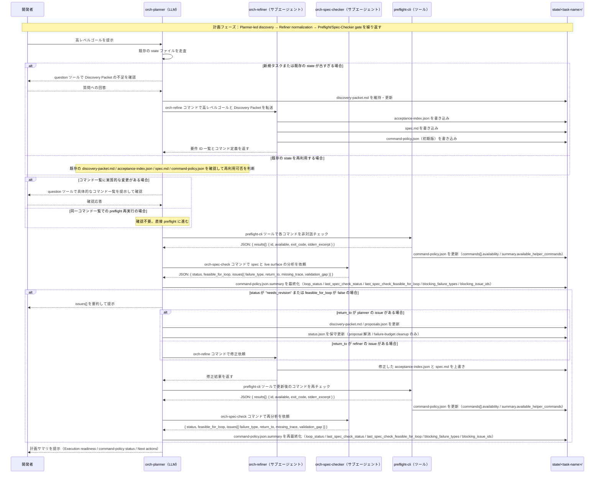
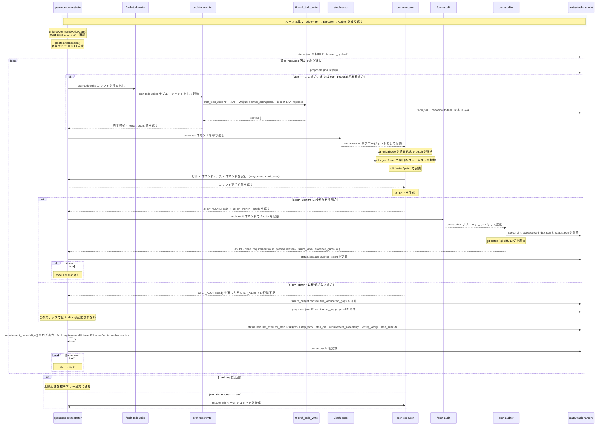

# Orchestrator エージェントの役割整理

このドキュメントは、`opencode-orchestrator` パイプラインに登場する各エージェント／コマンドの役割と、
それぞれが主に「どのファイルを読むか / 書くか / どんな出力を返すか」を、実際のプロンプトとコード
（`agents/*.md`, `commands/*.md`, `src/orchestrator-*.ts` など）に基づいてまとめたものです。

## 1. 共通コンポーネント

- `agents/*.md`
  - 各エージェントのシステムプロンプト（役割・制約・入出力契約）を英語で定義。
  - 各エージェントの出力言語ポリシーや、どのパスに対して読み書き可能かを明示。
- `commands/orch-*.md`
  - Orchestrator 関連 CLI コマンドの「ユーザープロンプト」部分を定義。
  - `opencode run --command orch-...` 実行時に `$ARGUMENTS` が差し込まれる。
- `src/orchestrator-agents.ts`
  - `orchestratorAgents` テーブルで、各エージェントの使用可能ツールと permission を定義。
- `src/orchestrator-commands.ts`
  - `orchestratorCommands` テーブルで、`orch-todo-write` などのコマンド名 → 紐づくエージェント名
    （`agent` フィールド）を定義。
- **コマンドとツールの違い**
  - **カスタムコマンド**（例：`orch-todo-write`、`orch-exec`）は OpenCode が `opencode run --command <name>` で起動する単位。引数の概念はなく、プロンプトは `commands/<name>.md` に定義される。
  - **カスタムツール**（例：`orch_todo_write`、`preflight-cli`）は LLM が内部的に呼び出す関数で、`mode` などの引数を持つ。実装は `src/orchestrator-*.ts` に定義される。
  - Orchestrator-loop は**コマンド**を呼び出してサブエージェントを起動し、サブエージェントが**ツール**を内部的に使って state を読み書きする。
- `src/orchestrator-loop.ts`
  - 実際の Orchestrator ループ本体。`orch-todo-write`/`orch-exec`/`orch-audit` を組み合わせて
    セッションを進行し、`state/` 配下の各種ファイルを読み書きする。
- Orchestrator 共通状態ディレクトリ
  - ベースパス: `$XDG_STATE_HOME/opencode/orchestrator/<task-name>/state/`
  - 主なファイル:
    - `acceptance-index.json` … 要件一覧（Refiner オーナー）
    - `spec.md` … story spec (Refiner-owned)
    - `todo.json` … Todo-Writer が生成する canonical todo 一覧
    - `command-policy.json` … Refiner-owned `commands[]` と Planner-owned `summary` を持つ planning gate のソース・オブ・トゥルース
    - `status.json` … `orchestrator-loop` が更新する Executor / Auditor 進捗スナップショット
      - 直近の executor / auditor スナップショットに加えて
        failure budget を保持する。
      - Planner が触るとしても、proposal 解消や failure-budget cleanup に伴う保守的な maintenance 更新に限る。
      - proposal queue は別ファイル (`proposals.json`) に格納される。

以下、エージェント／コマンドごとに、(A) 役割, (B) 主な入力ファイル, (C) 主な出力ファイル,
(D) プロンプト上の出力仕様 を整理します。

## 1.5. シーケンス図

> **前提：コマンドとツールの違い**
>
> - **カスタムコマンド**（例：`orch-todo-write`）は OpenCode TUI や Planner（LLM）が `opencode run --command orch-todo-write` で呼び出すもの。引数の概念はない。対応するプロンプトは `commands/orch-todo-write.md` にあり、増分 replanning を優先しつつ、必要時のみ全置換する方針を brief に与える。
> - **カスタムツール**（例：`orch_todo_write`）は LLM が内部的に使うツールで、`mode` などの引数を持つ。対応する実装は `src/orchestrator-todo.ts`。
> - Orchestrator-loop は**コマンド**を呼び出してサブエージェントを起動し、サブエージェントが**ツール**を内部的に使って state を読み書きする。

---

### 1.5.1. TUI 計画フェーズ（Planning Loop）


```mermaid
sequenceDiagram
    participant Human as 開発者
    participant Planner as orch-planner（LLM）
    participant RefinerAgent as orch-refiner（サブエージェント）
    participant SpecCheckerAgent as orch-spec-checker（サブエージェント）
    participant PreflightTool as preflight-cli（ツール）
    participant StateDir as state/<task-name>/

    rect rgba(200, 220, 240, 0.15)
        Note over Human,StateDir: 計画フェーズ：Planner-led discovery → Refiner normalization → Preflight/Spec-Checker gate を繰り返す
    end

    Human->>Planner: 高レベルゴールを提示
    Planner->>Planner: 既存の state ファイルを走査

    alt 新規タスクまたは既存の state が古すぎる場合
        Planner-->>Human: question ツールで Discovery Packet の不足を確認
        Human-->>Planner: 質問への回答
        Planner->>StateDir: discovery-packet.md を維持・更新
        Planner->>RefinerAgent: orch-refine コマンドで高レベルゴールと Discovery Packet を転送
        RefinerAgent->>StateDir: acceptance-index.json を書き込み
        RefinerAgent->>StateDir: spec.md を書き込み
        RefinerAgent->>StateDir: command-policy.json（初期版）を書き込み
        RefinerAgent-->>Planner: 要件 ID 一覧とコマンド定義を返す
    else 既存の state を再利用する場合
        Note over Planner: 既存の discovery-packet.md / acceptance-index.json / spec.md / command-policy.json を確認して再利用可否を判断
    end

    alt コマンド一覧に実質的な変更がある場合
        Planner-->>Human: question ツールで具体的なコマンド一覧を提示して確認
        Human-->>Planner: 確認応答
    else 同一コマンド一覧での preflight 再実行の場合
        Note over Planner: 確認不要。直接 preflight に進む
    end
    Planner->>PreflightTool: preflight-cli ツールで各コマンドを非対話チェック
    PreflightTool-->>Planner: JSON: { results[]: { id, available, exit_code, stderr_excerpt } }
    PreflightTool->>StateDir: command-policy.json を更新（commands[].availability / summary.available_helper_commands）

    Planner->>SpecCheckerAgent: orch-spec-check コマンドで spec と live surface の分析を依頼
    SpecCheckerAgent-->>Planner: JSON: { status, feasible_for_loop, issues[{ failure_type, return_to, missing_trace, validation_gap }] }
    Planner->>StateDir: command-policy.json.summary を最終化（loop_status / last_spec_check_status / last_spec_check_feasible_for_loop / blocking_failure_types / blocking_issue_ids）

    alt status が "needs_revision" または feasible_for_loop が false の場合
        Planner-->>Human: issues[] を要約して提示
        alt return_to が planner の issue がある場合
            Planner->>StateDir: discovery-packet.md / proposals.json を更新
            Planner->>StateDir: status.json を保守更新（proposal 解消 / failure-budget cleanup のみ）
        else return_to が refiner の issue がある場合
            Planner->>RefinerAgent: orch-refine コマンドで修正依頼
        end
        RefinerAgent->>StateDir: 修正した acceptance-index.json と spec.md を上書き
        RefinerAgent-->>Planner: 修正結果を返す
        Planner->>PreflightTool: preflight-cli ツールで更新後のコマンドを再チェック
        PreflightTool-->>Planner: JSON: { results[]: { id, available, exit_code, stderr_excerpt } }
        PreflightTool->>StateDir: command-policy.json を更新（commands[].availability / summary.available_helper_commands）
        Planner->>SpecCheckerAgent: orch-spec-check コマンドで再分析を依頼
        SpecCheckerAgent-->>Planner: { status, feasible_for_loop, issues[{ failure_type, return_to, missing_trace, validation_gap }] }
        Planner->>StateDir: command-policy.json.summary を再最終化（loop_status / last_spec_check_status / last_spec_check_feasible_for_loop / blocking_failure_types / blocking_issue_ids）
    end

    Planner-->>Human: 計画サマリを提示（Execution readiness / command-policy status / Next actions）
```

**図 1.5.1 補足：TUI 計画フェーズのポイント**

- Planner（LLM）は discovery の主担当として `question` ツールで不足決定を埋め、**orch-refine / orch-spec-check** の**カスタムコマンド**でサブエージェントを起動する。
- Planner は discovery のオーナーとして `discovery-packet.md` を保持し、共有契約として必須なのは承認済みの discovery decisions / non-goals / validation view の 3 項目である。その他の見出しは Planner 側の discovery 補助構造として扱う。
- Preflight の可否判定は `preflight-cli` **ツール**が担当し、Refiner が定義したコマンドと helper コマンドに対して permission.bash ルールをローカル評価する。
- Preflight は `commands[].availability` と `summary.available_helper_commands` の mechanical refresh までを担い、`summary.loop_status` は更新しない。最終確定は Planner が行う。
- Refiner は Discovery Packet を reopening せず canonical state へ正規化し、Planner は `command-policy.json` が存在する story では常に preflight を挟んでから Spec-Checker に監査させる。
- Refiner / Preflight / Spec-Checker のサイクルは、少なくとも `status === "ok"` かつ `feasible_for_loop === true` になるまで何度でも回る。これらは readiness の必要条件ではあるが十分条件ではなく、Planner は unresolved な blocking proposal / blocking decision も解消したうえで最終判定する。
- Spec-Checker の routed failure は `return_to` に従って Planner 自身の discovery 修正か Refiner への差し戻しかを分岐させる。
- `command-policy.json.commands[]` の定義は Refiner が保持し、preflight-cli が `summary.available_helper_commands` と `commands[].availability` を更新する。Planner はその結果を集約して `command-policy.json.summary.loop_status` を strict readiness gate として最終化し、人間に readiness を伝える。
- Spec-Checker の `severity` は人間向けの説明順序づけ専用であり、機械 gate には使わない。機械 gate は `status` / `feasible_for_loop` / routed failures に基づく。

---

### 1.5.2. Executor ループ実行フェーズ（Execution Loop）


```mermaid
sequenceDiagram
    participant CLI as opencode-orchestrator
    participant TWCommand as /orch-todo-write
    participant TWAgent as orch-todo-writer
    participant TWTool as ⚙orch_todo_write
    participant EXCommand as /orch-exec
    participant EXAgent as orch-executor
    participant AUCommand as /orch-audit
    participant AUAgent as orch-auditor
    participant StateDir as state/<task-name>/

    rect rgba(200, 220, 240, 0.15)
        Note over CLI,StateDir: ループ本体：Todo-Writer → Executor → Auditor を繰り返す
    end

    Note over CLI: enforceCommandPolicyGate()<br/>must_exec のコマンド確認
    Note over CLI: createInitialSession()<br/>新規セッション ID 生成
    CLI->>StateDir: status.json を初期化（current_cycle=1）

    loop 最大 maxLoop 回まで繰り返し
        CLI->>StateDir: proposals.json を参照

        alt step === 1 の場合、または open proposal がある場合
            CLI->>TWCommand: orch-todo-write コマンドを呼び出し
            TWCommand-->>TWAgent: orch-todo-writer サブエージェントとして起動
            TWAgent->>TWTool: orch_todo_write ツール\n（通常は planner_add/update、必要時のみ replace）
            TWTool->>StateDir: todo.json（canonical todos）を書き込み
            TWTool-->>TWAgent: { ok: true }
            TWAgent-->>CLI: 完了通知・restart_count 等を返す
        end

        CLI->>EXCommand: orch-exec コマンドを呼び出し
        EXCommand-->>EXAgent: orch-executor サブエージェントとして起動
        Note over EXAgent: canonical todo を読み込んで batch を選択
        Note over EXAgent: glob / grep / read で周囲のコンテキストを把握
        Note over EXAgent: edit / write / patch で実装
        EXAgent->>CLI: ビルドコマンド / テストコマンドを実行（may_exec / must_exec）
        CLI-->>EXAgent: コマンド実行結果を返す

        Note over EXAgent: STEP_* を生成

        alt STEP_VERIFY に根拠がある場合
            EXAgent-->>CLI: STEP_AUDIT: ready と STEP_VERIFY: ready を返す
            CLI->>AUCommand: orch-audit コマンドで Auditor を起動
            AUCommand-->>AUAgent: orch-auditor サブエージェントとして起動
            AUAgent->>StateDir: spec.md と acceptance-index.json と status.json を参照
            Note over AUAgent: git status / git diff / ログを調査
            AUAgent-->>CLI: JSON: { done, requirements\[{ id, passed, reason?, failure_kind?, evidence_gaps? }\] }
            CLI->>StateDir: status.json.last_auditor_report を更新
            alt done === true
                Note over CLI: done = true を返却
            end
        else STEP_VERIFY に根拠がない場合
            EXAgent-->>CLI: STEP_AUDIT: ready を返したが STEP_VERIFY の根拠不足
            CLI->>StateDir: failure_budget.consecutive_verification_gaps を加算
            CLI->>StateDir: proposals.json に verification_gap proposal を追加
            Note over CLI: このステップでは Auditor は起動されない
        end

        CLI->>StateDir: status.json.last_executor_step を更新\n（step_todo、step_diff、requirement_traceability、\nstep_verify、step_audit 等）
        CLI->>CLI: requirement_traceability\[\] をログ出力：\n「requirement diff trace: R1 -> src/foo.ts, src/foo.test.ts」
        CLI->>StateDir: current_cycle を加算

        break [done === true]
            Note over CLI: ループ終了
        end
    end

    alt maxLoop に到達
        Note over CLI: 上限到達を標準エラー出力に通知
    else commitOnDone === true
        CLI->>EXAgent: autocommit ツールでコミットを作成
        EXAgent-->>CLI:
    end
```

**図 1.5.2 補足：Executor ループ実行フェーズのポイント**

コマンド層とツール層の区別：

| 呼び出し元                           | 呼び出し先      | 種類         | 備考                                                                                        |
| ------------------------------------ | --------------- | ------------ | ------------------------------------------------------------------------------------------- |
| CLI（orchestrator-loop）             | orch-todo-write | **コマンド** | `runOpencode(["run", "--command", "orch-todo-write", ...])`                                 |
| CLI（orchestrator-loop）             | orch-exec       | **コマンド** | 同上                                                                                        |
| CLI（orchestrator-loop）             | orch-audit      | **コマンド** | JSON 出力で Auditor を起動                                                                  |
| orch-todo-writer（サブエージェント） | orch_todo_write | **ツール**   | 通常は `planner_add_todos` / `planner_update_todos`、必要時のみ `planner_replace_canonical` |
| orch-executor（サブエージェント）    | orch_todo_write | **ツール**   | `mode=executor_update_statuses`                                                             |

各ステップで `status.json` に書き込まれる主なデータ:

| フィールド            | 内容                                                                                                                                 |
| --------------------- | ------------------------------------------------------------------------------------------------------------------------------------ |
| `last_executor_step`  | `step_todo` / `step_diff` / `step_cmd` / `step_intent` / `step_verify` / `step_audit` / `requirement_traceability`                   |
| `last_auditor_report` | `{ done, requirements[{id, passed, reason?, failure_kind?, evidence_gaps?}] }`                                                       |
| `proposals.json`      | Executor / Auditor / Todo-Writer などの loop actors が populate する live proposal queue。Planner は replanning 時にクリア／調整する |
| `failure_budget`      | verification_gap・audit_failed 等の連続カウント                                                                                      |
| `current_cycle`       | ステップ番号（1 始まり）                                                                                                             |

`requirement_traceability` は `parseExecutorStepSnapshot()` の中で `buildRequirementDiffTrace()` により `step_todo` / `step_diff` / `step_intent` / `step_audit` から自動導出される。各ステップで Auditor が requirement から代表ファイルへ追跡できる道筋が確保されている。

---

## 2. orch-planner

- 実体
  - エージェント: `orch-planner` (`agents/orch-planner.md`)
  - スラッシュコマンド: なし
  - 計画全体を `orch-planner` が `task=orch-refiner` / `task=orch-spec-checker` を使って主導する
    （エージェント設定は `src/orchestrator-agents.ts` 参照）。

- (A) 役割
  - 高レベルのゴールから、Executor ループ実行前に必要な「オーケストレータ状態」を整備する
    プランニングコーディネータ。
  - Planner-owned discovery artifact として `discovery-packet.md` を維持し、共有契約として必須な `resolved decisions` / `explicit non-goals` / `validation view` を current task の planning contract として保持する。
  - `orch-refiner` / `orch-spec-checker` を呼び分け、preflight 用には `preflight-cli` ツールを使用して
    `acceptance-index.json`, `spec.md`, `command-policy.json`, spec-check レポート、preflight 結果
    などを揃える。
  - Refiner が `command-policy.json.commands[]` の定義を保持し、preflight-cli が
    `summary.available_helper_commands` / `commands[].availability` を更新する。Planner はその結果を集約して
    `command-policy.json.summary.loop_status` の strict readiness gate を最終化する。

- (B) 主な入力（読むファイル）
  - `$XDG_STATE_HOME/opencode/orchestrator/<task-name>/state/discovery-packet.md`
  - `$XDG_STATE_HOME/opencode/orchestrator/<task-name>/state/acceptance-index.json`
  - `$XDG_STATE_HOME/opencode/orchestrator/<task-name>/state/spec.md`
  - `$XDG_STATE_HOME/opencode/orchestrator/<task-name>/state/command-policy.json`
  - リポジトリ内コード／ドキュメント（必要に応じて `read`/`glob`/`grep`）

- (C) 主な出力（書くファイル）
  - `$XDG_STATE_HOME/opencode/orchestrator/<task-name>/state/discovery-packet.md`
    - Planner-owned discovery artifact。現在の承認済み decision / non-goal / validation view を保持。
  - `$XDG_STATE_HOME/opencode/orchestrator/<task-name>/state/command-policy.json`
    - `summary` 配下の strict readiness metadata を Planner が最終化する。
  - `$XDG_STATE_HOME/opencode/orchestrator/<task-name>/state/proposals.json`
    - live proposal queue は loop actors が populate し、Planner は replanning 時のクリア／調整だけを行う。
  - `$XDG_STATE_HOME/opencode/orchestrator/<task-name>/state/status.json`
    - Planner の gate 判定を書き込む場所ではなく、Executor / Auditor の進捗スナップショットとして主に CLI が更新する。
    - Planner が触るとしても、proposal 解消や failure-budget cleanup に伴う保守的な maintenance 更新に限る。

- (D) 出力内容（プロンプト上の仕様）
  - 人間向けには、次のようなサマリを短いセクションで返す（`agents/orch-planner.md` 末尾参照）：
    - `Execution readiness`（executor ループを開始して良いか）
    - `command-policy status`（`loop_status` とコマンド可用性の要約）
    - `Required changes`（必要な追加作業）
    - `Next actions`（次に行うべきステップ）
  - 付随する spec-check / preflight 結果は JSON だが、Planner 自身の最終応答は
    上記の箇条書きテキスト。

## 3. orch-refiner / orch-refine

- 実体
  - エージェント: `orch-refiner` (`agents/orch-refiner.md`)
  - スラッシュコマンド: `orch-refine` (`commands/orch-refine.md`)

- (A) 役割
  - 要件の精査エージェント。高レベルゴールを「受け入れ条件付きの要求一覧」に落とし込む。
  - Planner-owned `discovery-packet.md` を入力契約として受け取り、承認済み discovery decisions を正規化して `acceptance-index.json` / `spec.md` / `command-policy.json.commands[]` に落とし込む。
  - `acceptance-index.json` と `spec.md` を **唯一** 書き換える権限を持つエージェント。
  - `command-policy.json.commands[]` の定義を担当し、
    コマンド ID やテンプレートの単一のソース・オブ・トゥルースになる。
  - `command-policy.json` の `commands[]` に含まれるコマンド定義は Refiner が唯一のオーナーであり、
    Planner や Spec-Checker はこれを読み取り専用で扱う。
  - goal / scope / non-goals / confirmed facts / defaults / プロジェクト指示 (`AGENTS.md` など) を
    別ソースとして明示的に区別し、下流エージェントが要件とデフォルトを混同しないようにする。
  - **補助エージェントの利用**: 要件精査の補強として、以下の 2 つの読み取り専用サブエージェントを
    `task` ツール経由で起動できる。ただし、これらの調査結果は「要件の根拠補助と選択肢整理」にのみ
    用い、それ単体を acceptance criteria に昇格させてはならない。
    - **Public Researcher** (`orch-public-researcher`): 外部のベストプラクティス候補、最近の慣行、
      比較軸を収集。技術選定が未確定な場合や最新性が重要な場合に使用。
    - **Local Investigator** (`orch-local-investigator`): リポジトリ内の既存慣行、流用可能パターン、
      自然な実装位置を収集。既存コードベース整合性が重要な場合や、質問前に repo から確定できる
      事実がある場合に使用。
  - **4 区分の内部表現**: 収集した情報を以下の 4 種類に分類し、混同しないようにする。
    - **user-stated requirement**: ユーザーが明示した要求
    - **repo-derived constraint**: リポジトリから読める制約や既存慣行
    - **public best-practice candidate**: 公開情報から得た候補や推奨（ユーザー確認後に要件化可能）
    - **planner-owned discovery gap**: Planner 側の discovery packet に残る未解決事項や確認待ち事項
  - `spec.md` には、Planner が確定した discovery packet を正規化した結果として
    goal / scope / non-goals / constraints / validation view などを分離して記録する。

- (B) 主な入力
  - `$XDG_STATE_HOME/opencode/orchestrator/<task-name>/state/discovery-packet.md`
  - 高レベルゴール（CLI 引数 / 添付ファイルで渡される）
  - `$XDG_STATE_HOME/opencode/orchestrator/<task-name>/state/acceptance-index.json`（既存があれば）
  - `$XDG_STATE_HOME/opencode/orchestrator/<task-name>/state/spec.md`（既存があれば）
  - `$XDG_STATE_HOME/opencode/orchestrator/<task-name>/state/command-policy.json`（既存があれば）
  - リポジトリのコード／ドキュメント（`read`/`glob`/`grep`）
  - 補助エージェントからの調査結果（`task` ツール経由）:
    - `orch-public-researcher`: 外部ベストプラクティス候補・比較軸
    - `orch-local-investigator`: リポジトリ内既存パターン・制約

- (C) 主な出力
  - `$XDG_STATE_HOME/opencode/orchestrator/<task-name>/state/acceptance-index.json`
    - `version`, `requirements[]` などの構造化された受け入れ条件
      （説明文は user-facing task と同じ自然言語。高優先度指示があればそれに従う）。
  - `$XDG_STATE_HOME/opencode/orchestrator/<task-name>/state/spec.md`
    - タスクのゴール、非ゴール、制約、期待成果物、Done 条件など
      （user-facing task と同じ自然言語。高優先度指示があればそれに従う）。
  - `$XDG_STATE_HOME/opencode/orchestrator/<task-name>/state/command-policy.json`
    - 初期の `commands[]` リストと、Planner が後続で最終化できる `summary` の初期値を定義。

- (D) 出力内容
  - エージェントの通常応答としては、
    - 受け入れ条件の箇条書き概要
    - 主要な requirement ID と内容
    - 必要コマンド候補（ID, command, role, usage, parameters など）
      を短く説明するテキスト。
  - ファイル内容そのものは JSON / Markdown として state ディレクトリに書き出される。

## 4. orch-spec-checker / orch-spec-check

- 実体
  - エージェント: `orch-spec-checker` (`agents/orch-spec-checker.md`)
  - スラッシュコマンド: `orch-spec-check` (`commands/orch-spec-check.md`)

- (A) 役割
  - 受け入れ仕様と command-policy の構造検査を行う読み取り専用エージェント。
  - acceptance-index / spec / command-policy.json の構造問題・抜け・矛盾を検査し、
    JSON レポートの `issues[]` にコマンド候補の不足・過剰・安全性・テンプレート化の
    観点を含めて返す。
  - `discovery-packet.md` と acceptance/spec/command-policy のトレースも確認し、Planner-owned discovery の欠落、unauthorized scope reduction、validation gap を routed failure として Planner または Refiner に返す。
  - `severity` は説明優先度の付与にのみ使い、machine gating は `status` / `feasible_for_loop` / routed failure fields に委ねる。
  - 以下の追加観点も検出する:
    - spec.md 内で指示ソース（goal / non-goals / confirmed facts / defaults / プロジェクト指示）
      が曖昧にブレンドされている構造的問題
    - 弱い証拠境界（requirement の完了証明にファイル・コマンド・状態変化の hook がないもの）
    - wrapper script や複合 shell エントリポイントを隠す unsafe なコマンド定義
    - command-policy 変更時の Planner 確認ルールの曖昧さ

- (B) 主な入力
  - `$XDG_STATE_HOME/opencode/orchestrator/<task-name>/state/discovery-packet.md`
  - `$XDG_STATE_HOME/opencode/orchestrator/<task-name>/state/acceptance-index.json`
  - `$XDG_STATE_HOME/opencode/orchestrator/<task-name>/state/spec.md`
  - `$XDG_STATE_HOME/opencode/orchestrator/<task-name>/state/command-policy.json`
  - 必要に応じてリポジトリ内ファイル（`read`/`glob`/`grep`）

- (C) 主な出力
  - 1 行の JSON オブジェクトのみを標準出力に返す契約。
  - 構造例（実際の仕様より抜粋）:
    - `status`: `"ok"` / `"needs_revision"`
    - `feasible_for_loop`: orchestrator ループに載せられるかのブール値
    - `issues[]`: acceptance-index / spec / command-policy に関する問題一覧（`summary`/`suggested_action` は英語）
      - 各 issue は `failure_type`, `return_to`, `missing_trace`, `validation_gap` を含み、routed failure として Planner か Refiner に返す。

## 5. Preflight（preflight-cli ツール）

- 実体
  - ツール: `preflight-cli` (`src/preflight-cli.ts`)

- (A) 役割
  - Spec-Checker / Refiner が定義した「候補コマンド」が現在の permission.bash ルールの下で実行可能かを、LLM を起動せずにローカルで判定する。
  - Refiner が定義したコマンドに加えて、`resources/helper-commands.json` に定義された helper コマンド群の可用性も併せて評価する。
  - strict readiness の最終判定は担当せず、Planner が gate 判定に必要な mechanical input を更新するための補助に徹する。

- (B) 主な入力
  - Planner からツール引数として渡される command descriptors 配列:
    - `[ { "id": "cmd-dotnet-test", "command": "dotnet test", "role": "test", "usage": "must_exec" }, ... ]`
  - 各 `command` はテンプレート展開済みの「最終的な 1 行コマンド」。

- (C) 主な出力（ファイル）
  - `command-policy.json` の更新のみ（`summary.available_helper_commands` / 各 `commands[].availability`）。

- (D) 出力内容
  - ツール戻り値として 1 行の JSON オブジェクト（`{ status, results[] }`）。
  - 構造:
    - `status`: `"ok"` / `"failed"`
    - `results[]`: 各コマンドごとの
      - `id`, `command`, `role`, `usage`
      - `available`（boolean）
      - `exit_code`
      - `stderr_excerpt`（短い説明。preflight-cli では permission.bash 由来の短い英語メッセージを使用）

## 6. orch-todo-writer / orch-todo-write

- 実体
  - エージェント: `orch-todo-writer` (`agents/orch-todo-writer.md`)
  - スラッシュコマンド: `orch-todo-write` (`commands/orch-todo-write.md`)
  - 初回セッション作成やループ内の「プラン更新ステップ」として呼び出される（`src/orchestrator-loop.ts`）。

- (A) 役割
  - Refiner が作成した受け入れ要件から「Executor が実行する Todo」を構造化して作る。
  - Todo は `id` / `summary` / `status` / `related_requirement_ids[]` を持ち、
    acceptance-index 内の要件とのトレーサビリティを確保する。
  - 既存の canonical todo が有効な限りは、増分 replanning（`planner_add_todos` / `planner_update_todos`）を通常経路とし、全置換（`planner_replace_canonical`）は todo cache 欠損・破損・要件変更による salvage 不可ケースの fallback に限定する。
  - 各 Todo を 15-30 分程度で完了する bounded unit に保ち、
    主作業面・橋渡し作業・期待証拠・完了境界を decision-complete な形で明示する。
  - `execution_contract` メタデータ (`intent`, `expected_evidence`, `command_ids`, `audit_ready_when`)
    を添付することで、Executor と Auditor が todo だけで証拠境界を推測なしに把握できるようにする。
  - 大きい requirement は垂直スライス（実装 + テスト + 関連する docs/prompt を一并に完了境界まで持っていく）
    で分解し、layer-only な巨大 todo バケットを避ける。

- (B) 主な入力
  - `$XDG_STATE_HOME/opencode/orchestrator/<task-name>/state/acceptance-index.json`
  - `$XDG_STATE_HOME/opencode/orchestrator/<task-name>/state/spec.md`
    - 特に `Resolved decisions` / `Explicit non-goals` / `Validation view` を execution-facing contract として参照する。
  - `$XDG_STATE_HOME/opencode/orchestrator/<task-name>/state/command-policy.json`
    - `execution_contract.command_ids` の正本。Todo-Writer はここに存在しない command id を invent しない。
  - `$XDG_STATE_HOME/opencode/orchestrator/<task-name>/state/status.json`
  - `$XDG_STATE_HOME/opencode/orchestrator/<task-name>/state/proposals.json`
    - open な提案がある場合は、Todo-Writer にとっての第一級の再計画入力として扱う。
  - `$XDG_STATE_HOME/opencode/orchestrator/<task-name>/state/todo.json`
  - `orch_todo_read` ツールからの既存 canonical todo 群

- (C) 主な出力
  - `$XDG_STATE_HOME/opencode/orchestrator/<task-name>/state/todo.json`
    - `orch_todo_write` ツールを通じて保守される canonical todo 一覧。通常は
      `planner_add_todos` / `planner_update_todos` による増分更新で、必要時のみ
      `planner_replace_canonical` による全再生成を行う。型定義は
      `src/orchestrator-todo.ts` の `CanonicalTodo`。
  - OpenCode セッション Todo（`todowrite` 経由）
    - UI 表示用に、フィルタ済みの一部 Todo をセッション Todo としてミラーする。

- (D) 出力内容
  - エージェント応答としては、どの要件に対してどのような Todo を追加／更新したかの
    簡潔な説明テキスト。
  - 具体的な Todo 構造は `todo.json` の JSON として保存される。

## 7. orch-executor / orch-exec

- 実体
  - エージェント: `orch-executor` (`agents/orch-executor.md`)
  - スラッシュコマンド: `orch-exec` (`commands/orch-exec.md`)
  - Orchestrator ループ本体から各ステップ毎に呼び出される（`src/orchestrator-loop.ts`）。

- (A) 役割
  - 実装＋検証担当エージェント。コード／テスト／ドキュメントへの具体的な変更と、
    ローカルのビルドやテスト実行を担う。
  - Todo 構造そのものは変更せず、`status` 更新のみを行う。
  - 各 step の開始時に短い preamble と tiny step-local plan を持ち、`STEP_INTENT` は具体的変更単位を名乗る。
  - `STEP_VERIFY: ready` は command IDs・明示的に再確認した diffs・no-command 理由のうち
    少なくとも 1 つを根拠として要求する（根拠なしでは audit handoff できない）。
  - 主要 requirement の作業では requirement-to-diff トレーサビリティを残し、`git status --short` や
    `git diff -- <path>` で Auditor が requirement から代表ファイルへ追跡可能にする。
  - ビルドコマンドやテストコマンドは回帰確認の補助証拠であり、requirement ごとの diff 証拠の代替ではない。
  - ルーティングは軽量・逐次的: 委譲は広範な read-only 探索に使い、実装自体は local で担う。
    並列 executor 分岐や外部キューを前提にした振る舞いは禁止。

- (B) 主な入力
  - `$XDG_STATE_HOME/opencode/orchestrator/<task-name>/state/acceptance-index.json`
  - `$XDG_STATE_HOME/opencode/orchestrator/<task-name>/state/spec.md`
  - `$XDG_STATE_HOME/opencode/orchestrator/<task-name>/state/todo.json`
    - `orch_todo_read` で読み取る canonical todos。
  - `$XDG_STATE_HOME/opencode/orchestrator/<task-name>/state/command-policy.json`
    - 実行可能とされているコマンドのみ `bash` で実行する。（テンプレート付きコマンドの
      具体値選択もここで行う。）
  - リポジトリ内のコード／テスト／ドキュメント（`glob`/`grep`/`read`/`edit` など）。

- (C) 主な出力（ファイル）
  - `$XDG_STATE_HOME/opencode/orchestrator/<task-name>/state/todo.json`
    - `orch_todo_write(mode=executor_update_statuses)` により Todo の `status` を更新。
    - `result_artifacts[].path` は `.opencode/orchestrator/<task-name>/artifacts/` 配下の workspace-relative path を保持する。
  - リポジトリ内のソースコード・テストコード・ドキュメント
    - `edit`/`patch`/`write` ツールで直接更新。
  - `.opencode/orchestrator/<task-name>/artifacts/`
    - `investigation_v1` / `verification_v1` などの JSON artifact を保存する workspace-local artifacts directory。
  - OpenCode セッション Todo（`todowrite`）
    - 現在の作業セットを UI にミラー。

- (D) 出力内容（プロトコル）
  - 各ステップの最終応答は、`agents/orch-executor.md` に定義された行指向プロトコルに従う:
    - `STEP_TODO:` 行（0個以上）
    - `STEP_DIFF:` 行（0個以上）
    - `STEP_CMD:` 行（0個以上）
    - `STEP_BLOCKER:` 行（0個以上）
    - `STEP_INTENT:` 行（ちょうど 1 個。必須）
    - `STEP_VERIFY:` 行（ちょうど 1 個。必須）
    - `STEP_AUDIT:` 行（ちょうど 1 個）
  - `STEP_INTENT` / `STEP_VERIFY` の ID 列はカンマ区切りで、`R1,R2` と `R1, R2` の両方を受理する。
  - これらは `src/orchestrator-status.ts` の `parseExecutorStepSnapshot` などでパースされ、
    `status.json` の `last_executor_step` / `failure_budget`
    などに反映される。

## 8. orch-auditor / orch-audit

- 実体
  - エージェント: `orch-auditor` (`agents/orch-auditor.md`)
  - スラッシュコマンド: `orch-audit` (`commands/orch-audit.md`)
  - Orchestrator ループから、Executor が `STEP_AUDIT: ready ...` と
    `STEP_VERIFY: ready ...` を同時に返したステップでのみ呼び出される
    （`src/orchestrator-loop.ts`）。

- (A) 役割
  - 開発ストーリーが受け入れ条件とプロジェクトゲート（テスト／ビルド／Lint／Docs）を
    全て満たしているかを、外部監査の立場から判定する。
  - 自身はコードやファイルを編集せず、`read` / `glob` / `grep` と Git の読み取り系コマンド、ログの確認だけを行う。

- (B) 主な入力
  - 高レベルゴール（オリジナルのプロンプト）
  - `$XDG_STATE_HOME/opencode/orchestrator/<task-name>/state/spec.md`
  - `$XDG_STATE_HOME/opencode/orchestrator/<task-name>/state/acceptance-index.json`
  - `$XDG_STATE_HOME/opencode/orchestrator/<task-name>/state/status.json`
    - `last_executor_step`、`last_auditor_report`、`failure_budget` など。参考情報であり、
      それ自体を証拠とは見なさない。Proposal queue は別ファイル (`proposals.json`) にある。
    - `last_auditor_report.requirements[]` は `{ id, passed, reason?, failure_kind?, evidence_gaps? }` を持ち、後続 replanning の structured failure input になる。
  - Git 差分・ログ・テストログなど（添付ファイルや `bash` 読み取り系コマンド経由）。

- (C) 主な出力（ファイル）
  - ファイルには書き込まない（`orchestrator-agents.ts` の permission で `write` は ask &
    acceptance-index への書き込みは deny）。
  - Orchestrator ループ側が `parseAuditResult`（`src/orchestrator-audit.ts`）で
    応答をパースし、`status.json` の `last_auditor_report` を更新する。

- (D) 出力内容
  - 1 行の JSON オブジェクトのみ（`agents/orch-auditor.md`）。
  - フィールド:
    - `done`: ストーリー全体が完了しているか（ブール）
    - `requirements[]`: `{ id, passed, reason?, failure_kind?, evidence_gaps? }` の配列
      - `reason` は英語テキスト。`passed: false` の場合は必須。
      - `failure_kind` は `passed: false` の場合に必須で、`missing_implementation` /
        `incomplete_implementation` / `missing_verification` / `weak_evidence` /
        `missing_investigation` / `artifact_mismatch` / `scope_unclear` のいずれか。
      - `evidence_gaps` は `passed: false` の場合に必須で、不足している証拠を具体的に
        記述する 1-3 個の英語文字列配列。

## 9. その他の補助エージェント

### 9.0 読み取り専用の補助サブエージェント

- `orch-local-investigator`
  - 役割: 現在のリポジトリ内だけを対象に、関数・型・設定キー・ファイルの所在と関係を調べる。
  - 主な利用者: Refiner / Executor。
  - 特徴: `glob` / `grep` / `read` / `lsp` / `list` を使う repository-local investigator であり、外部検索サービスには出ない。
- `orch-public-researcher`
  - 役割: ライブラリ仕様、既知の挙動差、設定方法など、リポジトリ外の公開情報を一次ソース付きで調査する。
  - 主な利用者: Refiner / Executor。
  - 特徴: non-interactive な leaf researcher として `websearch` / `webfetch` / `codesearch` を使い、追加質問前提ではなく「不足している public-safe input」を結果として返す。

### 9.1 orch-todo-writer / orch-executor 用ツール (`src/orchestrator-todo.ts`)

- `orch_todo_read` ツール
  - 目的: 指定タスクの canonical todo 一覧を JSON で取得する。
  - 読み取り対象ファイル: `$XDG_STATE_HOME/opencode/orchestrator/<task-name>/state/todo.json`
  - 呼び出し可能エージェント: `orch-todo-writer`, `orch-executor` のみ（それ以外は SPEC_ERROR）。
  - 出力: `{ todos: CanonicalTodo[] }` を JSON 文字列で返す。

- `orch_todo_write` ツール
  - 目的: canonical todo の書き換えまたは `status` 更新。
  - 書き込み対象ファイル: 上記と同じ `todo.json`。
  - `mode=planner_replace_canonical`（Todo-Writer 専用）
    - `canonicalTodos` 全体を受け取り、`todo.json` を丸ごと再生成する。
  - `mode=planner_add_todos`（Todo-Writer 専用）
    - 既存の canonical todo を保持したまま、新しい todo を末尾に追加する。`id` は自動採番される。
  - `mode=planner_update_todos`（Todo-Writer 専用）
    - 条件付きフィルタで既存 todo を選択し、`summary` や `related_requirement_ids`、`execution_contract`、`status` などを部分更新する。
  - `mode=executor_update_statuses`（Executor 専用）
    - 既存 todo の `status` と `result_artifacts` だけを更新。未知の `id` を指定した場合は SPEC_ERROR。

### 9.2 orchestrator-loop 自身 (`src/orchestrator-loop.ts`)

- (A) 役割
  - 1 タスク（`--task <task-name>`）について、以下を制御する:
    - 初回 `orch-todo-write` 呼び出しとセッション作成（`createInitialSession`）
    - 各ステップの Executor 実行 (`orch-exec`)
    - 必要に応じた Todo-Writer 実行 (`orch-todo-write` 再実行)
    - Auditor 実行 (`orch-audit`)
    - 安全装置（SAFETY トリガでのセッション再起動、`command-policy.json` ゲートなど）
  - ループ状態は `status.json` に保存し、UI や他エージェントが参照できるようにする。
  - 起動時に "loop mode: the executor and auditor do the job sequentially." をログ出力する。
  - 各 Executor ステップ後、`last_executor_step.requirement_traceability` をパースして
    `requirement diff trace: <req-id> -> <file1>, <file2>` をログ出力し、トレーサビリティを可視化する。

- (B) 主な入力ファイル
  - `$XDG_STATE_HOME/opencode/orchestrator/<task-name>/state/command-policy.json`
    - `enforceCommandPolicyGate` による起動前チェック。
  - `$XDG_STATE_HOME/opencode/orchestrator/<task-name>/state/acceptance-index.json`
  - `$XDG_STATE_HOME/opencode/orchestrator/<task-name>/state/spec.md`
  - `$XDG_STATE_HOME/opencode/orchestrator/<task-name>/state/todo.json`
  - `$XDG_STATE_HOME/opencode/orchestrator/<task-name>/state/status.json`（既存があれば）

- (C) 主な出力ファイル
  - `$XDG_STATE_HOME/opencode/orchestrator/<task-name>/state/status.json`
    - `last_session_id`, `current_cycle`, `last_executor_step`, `last_auditor_report`,
      `failure_budget` などを更新。
  - `$XDG_STATE_HOME/opencode/orchestrator/<task-name>/state/proposals.json`
    - open / resolved / dismissed proposal の状態を更新。
  - `$XDG_STATE_HOME/opencode/orchestrator/<task-name>/logs/` 配下
    - `orch_step_XXX.txt` / `audit_step_XXX.jsonl` / `todowriter_step_XXX.txt` などのログ。
  - `orchestrator_session_*.json`
    - セッションエクスポート JSON（`opencode export` の結果をファイル化）。

- (D) 出力内容
  - CLI 標準出力としては主にログメッセージ（英語中心）。
  - 成否としては `runLoop()` の戻り値（boolean）を CLI 層が exit code などに反映。

## 10. まとめ

- Planner が discovery packet を保持し、Refiner / Preflight-Runner / Spec-Checker / Planner が
  「仕様とコマンドポリシー」を整備し、
  Todo-Writer が「実行可能な Todo 構造」を生成し、Executor が「実装と検証」を行い、
  Auditor が「最終完了判定」を行う、という明確な責務分担になっている。
- Orchestrator ループ (`orchestrator-loop.ts`) はこれらのエージェントとコマンドを束ね、
  各ステップで state ディレクトリ配下のファイルを読み書きしながらストーリーを前に進める。
- `agent-roles.md` は、その全体像を俯瞰するためのリファレンスとして利用できる。

## 11. 主要 JSON ファイルのスキーマ

ここでは、実際の TypeScript 型定義やエージェント仕様に基づき、Orchestrator 周辺で生成・更新される
主な JSON ファイルのスキーマを要約する。

### 11.1 acceptance-index.json（概要）

- パス: `$XDG_STATE_HOME/opencode/orchestrator/<task-name>/state/acceptance-index.json`
- オーナー: `orch-refiner`
- 正確なスキーマは refiner 側で進化するが、少なくとも以下のような構造を前提としている
  （`agents/orch-refiner.md`, `agents/orch-spec-checker.md` より）:

```jsonc
{
  "version": 1,
  "north_star": "このタスクの最重要目的を1-2行で（例: 既存の動作を維持しつつAPIを追加する）",
  "requirements": [
    {
      "id": "R1-some-requirement", // 安定 ID（文字列）
      "title": "...", // 短い名前（任意）
      "description": "...", // user-facing task と同じ自然言語の受け入れ条件説明
      "acceptance": {
        // 受け入れ判定に関する追加情報（任意）
        "files": ["src/..."],
        "notes": "...",
      },
      "tags": ["..."], // 任意
      "commands": [
        // 必要コマンドへのリンク（任意）
        "cmd-npm-test",
      ],
    },
  ],
}
```

- 注意: `requirements[]` の各要素には少なくとも `id` と自然言語説明 (`description` 等) が存在し、
  ID はタスク内で安定して再利用されることが前提。
- `north_star` は必須フィールド。Todo-Writer と Executor の purpose re-read 自己点検で
  必ず参照される。1–2行でこのタスクの最重要目的を明記する。

### 11.2 command-policy.json

- パス: `$XDG_STATE_HOME/opencode/orchestrator/<task-name>/state/command-policy.json`
- オーナー: `commands[]` は `orch-refiner`、`commands[].availability` と `summary.available_helper_commands` は preflight、`summary` の strict readiness は `orch-planner`。
- `enforceCommandPolicyGate`（`src/orchestrator-loop.ts`）で期待されるスキーマ:

```jsonc
{
  "version": 1,
  "summary": {
    "loop_status": "ready_for_loop" | "needs_refinement" | "blocked_by_environment" | string,
    "available_helper_commands": string[],
    "last_spec_check_status": "ok" | "needs_revision" | string | null,
    "last_spec_check_feasible_for_loop": true | false | null,
    "blocking_failure_types": string[],
    "blocking_issue_ids": string[]
  },
  "commands": [
    {
      "id": "cmd-npm-test",                     // 安定 ID（kebab-case）
      "command": "npm test",                    // コマンド文字列またはテンプレート
      "role": "test" | "build" | "lint" | "doc" | "run" | "explore" | string,
      "usage": "must_exec" | "may_exec" | "doc_only", // クリティカル度
      "probe_command": "npm test -- --list",    // preflight 用の軽量コマンド
      "parameters": {                            // テンプレート使用時のパラメータ定義。なければ {}
        "pattern": { "description": "..." },
        "subdir": { "description": "..." }
      },
      "related_requirements": ["R1", "R2-ui"], // 関連要件。なければ []
      "usage_notes": "...",                    // user-facing task と同じ自然言語の note。なければ ""
      "availability": "available" | "unavailable" // preflight が付与
    }
  ]
}
```

- `version` は必須フィールドで、現行値は `1`。
- `summary.available_helper_commands` は必須フィールドで、このタスクで利用可能な helper ベースコマンド名（例: `"rg"`, `"grep"`, `"wc"`）の一覧を保持する。
- `summary.loop_status` は Planner が最終化する strict readiness gate であり、planning gate のソース・オブ・トゥルースになる。
- `summary.last_spec_check_status` と `summary.last_spec_check_feasible_for_loop` は、Planner が最後に採用した Spec-Checker top-level 判定を保持する。
- `summary.blocking_failure_types` と `summary.blocking_issue_ids` は、Planner が gate で blocking とみなした routed failure の要約を保持する。
- Preflight は `summary.available_helper_commands` と `commands[].availability` を更新するが、`summary.loop_status` は更新しない。
- Spec-Checker の `severity` は説明用であり、機械 gate は `status` / `feasible_for_loop` / routed failures を使う。
- `commands[]` の各オブジェクトは上記すべてのフィールドを必須で持つ。値がない場合も `[]` / `{}` / `""` で明示する。

- `enforceCommandPolicyGate` は特に `commands[].usage` と `commands[].availability` を見て、
  `usage == "must_exec"` かつ `availability != "available"` のコマンドが 1 つでもある場合は
  ループ開始をブロックする。

### 11.3 todo.json（Canonical Todo）

- パス: `$XDG_STATE_HOME/opencode/orchestrator/<task-name>/state/todo.json`
- オーナー:
  - 構造生成・維持: `orch-todo-writer`（通常は `mode=planner_add_todos` / `mode=planner_update_todos`、必要時のみ `mode=planner_replace_canonical`）
  - `status` 更新のみ: `orch-executor`（`mode=executor_update_statuses`）
- 型定義: `src/orchestrator-todo.ts` の `CanonicalTodo` / `CanonicalTodoFile`。
- 実際に書き出される形（`saveCanonicalTodos`）:

```jsonc
{
  "todos": [
    {
      "id": "T1-sample-setup-task",             // 安定 Todo ID
      "summary": "Create the API endpoint for R1", // natural-language description in the current user-facing language
      "status": "pending" | "in_progress" | "completed" | "cancelled",
      "related_requirement_ids": ["R1", "R2-ui"],
      "execution_contract": {                    // 任意・監査向け証拠境界
        "intent": "implement" | "verify" | "investigate",
        "expected_evidence": ["... 具体的な証拠の文字列 ..."],
        "command_ids": ["cmd-npm-test"],         // 任意・最も関連するコマンド policy ID
        "audit_ready_when": ["..."],             // 任意・監査 ready 条件
        "artifact_schema": "...",                // 任意・成果物のスキーマ名
        "artifact_filename": "..."               // 任意・成果物のファイル名
      },
      "result_artifacts": [                       // 任意・成果物のメタデータ
        {
          "kind": "investigation_v1",
          "path": ".opencode/orchestrator/<task-name>/artifacts/T1-sample-survey.json",
          "summary": "One-line English summary of the investigation artifact"
        }
      ]
    }
  ]
}
```

- 互換性のため、Reader 側は `CanonicalTodo[]` だけがトップにある配列形式も許容しているが、
  Orchestrator が自前で書き出す場合は上記オブジェクト形式が使われる。

### 11.4 status.json（orchestrator-loop 状態 / migration context）

- パス: `$XDG_STATE_HOME/opencode/orchestrator/<task-name>/state/status.json`
- オーナー: 主担当は `orchestrator-loop.ts`。Planner は replanning / proposal cleanup に伴う narrow な maintenance 更新だけを行いうる。
- 型定義: `src/orchestrator-status.ts` の `OrchestratorStatus`。

`status.json` は、CLI（orchestrator-loop）が主に書き込む Executor / Auditor 進捗スナップショットのみを持つ、比較的
小さな JSON です。planning gate のソース・オブ・トゥルースではありません。Planner が触るとしても、replanning / proposal cleanup に伴う narrow な maintenance 更新に限ります。ライブの proposal surface は `proposals.json` にあり、この節は loop 状態の
migration context として読むものです。現時点で CLI が書き込んでいるフィールドは、次の通りです。

```jsonc
{
  "version": 1,
  "last_session_id": "sess-...", // 直近の opencode セッション ID
  "current_cycle": 3, // 現在のループステップ番号
  "last_executor_step": {
    "step": 3,
    "session_id": "sess-...",
    "step_todo": [
      {
        "id": "T1-sample-setup-task",
        "requirements": ["R1"],
        "description": "...", // `STEP_TODO` から抽出
        "from": "pending", // 旧ステータス（任意）
        "to": "completed", // 新ステータス（任意）
      },
    ],
    "step_diff": [{ "path": "src/api.ts", "summary": "add endpoint" }],
    "requirement_traceability": [
      { "requirement_id": "R1", "representative_files": ["src/api.ts"] },
    ],
    "step_cmd": [
      {
        "command": "npm test",
        "command_id": "cmd-npm-test", // `STEP_CMD` の括弧内 / または null
        "status": "success", // 実際の文字列値（例）
        "outcome": "Test passed", // current user-facing language のサマリ
      },
    ],
    "step_blocker": [
      { "scope": "general", "tag": "need_replan", "reason": "..." },
    ],
    "step_intent": {
      "intent": "implement",
      "requirement_ids": ["R1", "R2"],
      "summary": "監査前の修正を完了した",
    },
    "step_verify": {
      "status": "ready",
      "command_ids": ["cmd-npm-test", "cmd-lint"],
      "summary": "監査に必要な検証ログが揃った",
    },
    "step_audit": {
      "status": "ready",
      "requirement_ids": ["R1", "R2"],
    },
    "raw_stdout": "...", // Executor の生出力（全文）
  },
  "last_auditor_report": {
    "cycle": 3,
    "done": false,
    "requirements": [
      {
        "id": "R1",
        "passed": false,
        "reason": "No test file covers the error-handling branch",
        "failure_kind": "missing_verification",
        "evidence_gaps": [
          "No test file exercises the error-handling branch in the auth module",
        ],
      },
    ],
  },
  "consecutive_env_blocked": 0,
  "failure_budget": {
    "todo_writer_safety_restarts": 0,
    "executor_safety_restarts": 0,
    "consecutive_env_blocked": 0,
    "consecutive_audit_failures": 0,
    "consecutive_verification_gaps": 1,
    "consecutive_contract_gaps": 0,
    "last_failure_kind": "verification_gap",
    "last_failure_summary": "監査準備を宣言したが STEP_VERIFY の根拠が不足している",
  },
}
```

#### 11.4.1 proposals.json（live proposal queue）

- パス: `$XDG_STATE_HOME/opencode/orchestrator/<task-name>/state/proposals.json`
- オーナー: populate は `orchestrator-loop.ts` と loop actors、replanning 時のクリア／調整は Planner
- 型定義: `src/orchestrator-proposals.ts` の `ProposalsFile` / `ProposalEntry`

```jsonc
{
  "version": 1,
  "proposals": [
    {
      "id": "p-...",
      "source": "executor", // または "auditor" / "todo_writer"
      "cycle": 3,
      "kind": "env_blocked", // env_blocked / need_replan / verification_gap / contract_gap / audit_failure / scope_change / priority_shift
      "priority": "high",
      "summary": "...",
      "details": "...",
      "related_requirement_ids": ["R1"],
      "related_todo_ids": ["T1"],
      "status": "open", // open / resolved / dismissed
      "auto_resolvable": true,
      "created_at": "2026-03-29T00:00:00.000Z",
      "resolved_at": "2026-03-29T01:00:00.000Z",
      "resolved_by": "auto",
    },
  ],
}
```

- `open` proposals are re-fed into replanning on later Todo-Writer passes until they are resolved or dismissed.
- `resolved` / `dismissed` proposals remain in the file for auditability.

- `requirement_traceability` は `parseExecutorStepSnapshot` 内で `buildRequirementDiffTrace()` により
  自動的に導出される。`STEP_TODO` / `STEP_DIFF` / `STEP_INTENT` / `STEP_AUDIT` から requirement ID と
  代表ファイル一覧を抽出し、各 requirement に対して `representative_files` を対応づける。
  Auditor や Planner が「どのファイルがどの requirement を満たすか」を todo だけで追跡できる。
- `proposals.json` は `last_executor_step.step_blocker` と `last_auditor_report.requirements`
  から CLI と loop actors が正規化して populate する「現在の live proposal queue」です。Todo-Writer は、生の履歴スナップショット
  を直接解釈する前に、まずこのキューを参照する想定です。Planner は replanning 時に解決済み提案のクリア／調整を行えます。
- `failure_budget.consecutive_verification_gaps` は `STEP_AUDIT: ready` なのに
  `STEP_VERIFY: ready` が伴わなかったステップだけを連続カウントし、通常の
  `STEP_AUDIT: in_progress` / 未監査ステップではリセットされます。

### 11.5 spec-checker 結果 JSON（orch-spec-check 出力）

- `orch-spec-check` コマンドの標準出力として 1 行 JSON を返す。
- スキーマ: `agents/orch-spec-checker.md` に準拠。

```jsonc
{
  "status": "ok" | "needs_revision",
  "feasible_for_loop": true,
  "issues": [
    {
      "id": "I1-missing-requirements",
      "severity": "info" | "warning" | "error",
      "target": "acceptance-index" | "commands" | "command-policy" | "structure" | string,
      "failure_type": "missing_trace" | "validation_gap" | "unauthorized_scope_reduction" | string,
      "return_to": "planner" | "refiner",
      "missing_trace": ["discovery-packet.md: resolved decision for R3"],
      "validation_gap": "",
      "summary": "...",           // English short description
      "suggested_action": "..."   // English improvement suggestion
    }
  ]
}
```

### 11.6 preflight 結果 JSON（preflight-cli 出力）

- `preflight-cli` ツールの戻り値として 1 行 JSON を返す。

```jsonc
{
  "status": "ok" | "failed",
  "results": [
    {
      "id": "cmd-npm-test",
      "command": "npm test",
      "role": "test",
      "usage": "must_exec",
      "available": true,
      "exit_code": 0,
      "stderr_excerpt": ""  // failure summary in English
    }
  ]
}
```

### 11.7 auditor 結果 JSON（orch-audit 出力）

- `orch-audit` コマンドの標準出力として 1 行 JSON を返す。
- スキーマ: `agents/orch-auditor.md` および `src/orchestrator-audit.ts` の `AuditSummary`。

```jsonc
{
  "done": true | false,
  "requirements": [
    {
      "id": "R1-some-requirement",
      "passed": true | false,
      "reason": "...",           // optional English explanation
      "failure_kind": "...",     // required when passed=false: one of
                                 // missing_implementation | incomplete_implementation |
                                 // missing_verification | weak_evidence |
                                 // missing_investigation | artifact_mismatch | scope_unclear
      "evidence_gaps": ["..."]   // required when passed=false: 1-3 concrete strings
    }
  ]
}
```

- `orchestrator-loop` 側ではこの JSON そのものではなく、OpenCode のストリーミング JSON
  から抽出した `part.text` をさらに `JSON.parse` して上記オブジェクトを得ている。

### 11.8 orch_todo_read / orch_todo_write の戻り値 JSON

- 実装: `src/orchestrator-todo.ts`

```jsonc
// orch_todo_read の戻り値
{
  "todos": [
    {
      "id": "T1-...",
      "summary": "...",
      "status": "pending" | "in_progress" | "completed" | "cancelled",
      "related_requirement_ids": ["R1", "R2-ui"]
    }
  ]
}

// orch_todo_write の戻り値（成功時）
{ "ok": true }

// orch_todo_write / orch_todo_read のエラー時
{
  "ok": false,
  "error": "SPEC_ERROR: ..."
}
```

### 11.9 orchestrator セッションエクスポート JSON

- パス: `$XDG_STATE_HOME/opencode/orchestrator/<task-name>/logs/orchestrator_session_*.json`
  （`runLoop()` 終了時に `opencode export` の stdout をそのまま保存）。
- スキーマ: OpenCode セッションの内部表現であり、このリポジトリ側では詳細を前提にしていない。
  - そのため、ここでは「opaque（不透明）」な JSON として扱う。
  - 利用は主にデバッグ／トラブルシュート用途。
