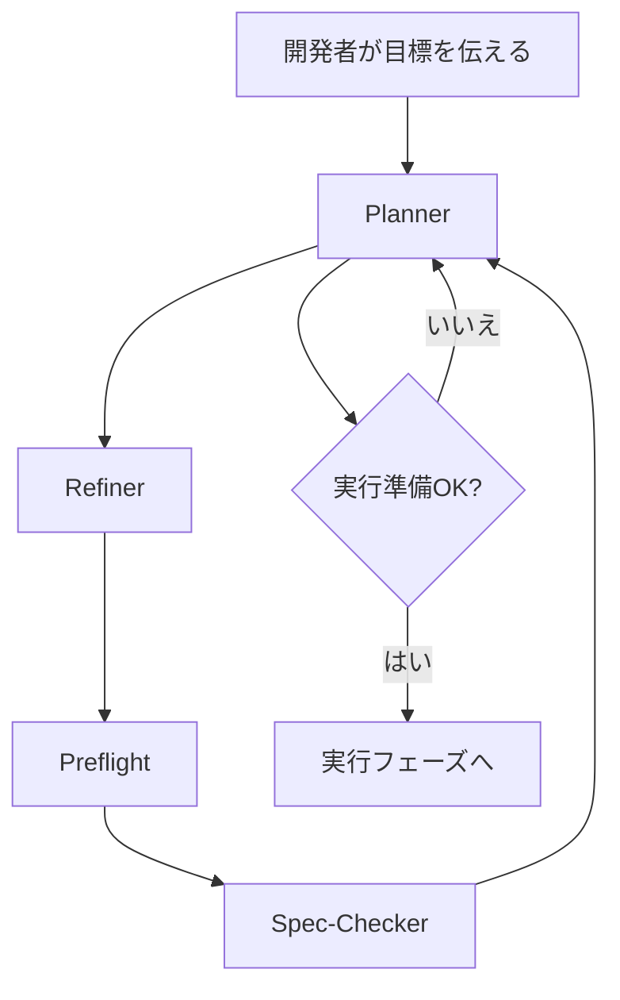
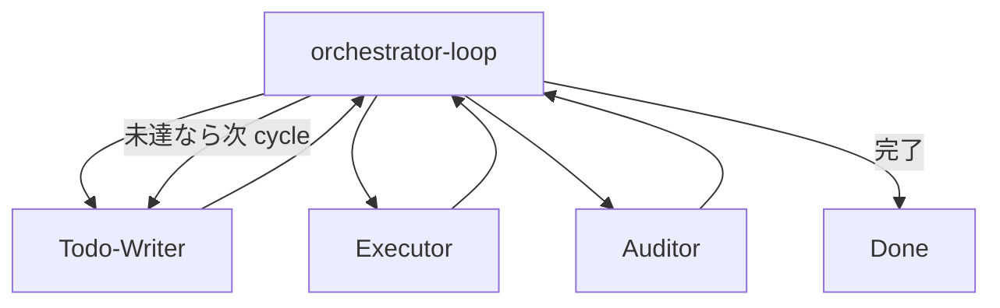

# Orchestrator エージェントの役割整理

この文書は、`opencode-orchestrator` に登場する各エージェント、コマンド、主要 state の
**責務分担・所有境界・受け渡し** を把握するためのリファレンスです。

実装の細部や完全なスキーマを最初から全部読むための文書ではありません。
まずは **全体像 → 主要ロール → 主要 state** の順で読み、必要なときだけ後半の付録を参照してください。

## この文書の読み方

- 最初に読みたい範囲
  - `1. 全体像`
  - `2. 基本用語`
  - `3. 主要 state と owner`
  - `4. フロー概要`
  - `5. 役割クイックリファレンス`
- 深掘りしたいときに読む範囲
  - `6. 詳細ロールリファレンス`
  - `7. 補助コンポーネント`
  - `8. ownership と handoff の要点`
  - `付録`

## 1. 全体像

Orchestrator は、大きく **計画フェーズ** と **実行フェーズ** の 2 段階で動きます。

### 計画フェーズ

- Planner が高レベルの目標を受け取る
- Refiner が要件・仕様・コマンド定義を正規化する
- Preflight が実行可能なコマンドか確認する
- Spec-Checker が仕様の抜けや矛盾を監査する
- Planner が loop 開始可否を最終判断する

### 実行フェーズ

- orchestrator-loop が Todo-Writer / Executor / Auditor を順番に呼ぶ
- Todo-Writer が実行単位を作る
- Executor がコード / テスト / ドキュメントを更新する
- Auditor が requirement ごとに達成状況を確認する
- 未達時の再計画や次 cycle への戻しは orchestrator-loop が媒介する

## 2. 基本用語

### コマンドとツールの違い

- **カスタムコマンド**
  - 例: `orch-todo-write`, `orch-exec`, `orch-audit`
  - `opencode run --command <name>` で起動する単位です。
  - 対応する prompt 本文は `commands/*.md` にあります。
- **カスタムツール**
  - 例: `orch_todo_write`, `preflight-cli`
  - エージェントが内部的に呼び出す関数です。
  - 実装は `src/**/*.ts` にあります。

要するに、**CLI / Planner / loop はコマンドを呼び、各エージェントは必要に応じてツールを呼びます。**

### 共通 state ディレクトリ

主要 state は、通常次のディレクトリに置かれます。

- `$XDG_STATE_HOME/opencode/orchestrator/<task-name>/state/`

## 3. 主要 state と owner

最初に覚えるべき state と owner は次のとおりです。

| ファイル                         | 主 owner                                | 役割                             |
| -------------------------------- | --------------------------------------- | -------------------------------- |
| `discovery-packet.md`            | Planner                                 | 計画フェーズの discovery 契約    |
| `acceptance-index.json`          | Refiner                                 | 受け入れ条件一覧                 |
| `spec.md`                        | Refiner                                 | ゴール、制約、非ゴール、検証観点 |
| `command-policy.json.commands[]` | Refiner                                 | 実行候補コマンドの定義           |
| `command-policy.json.summary`    | Planner                                 | loop 開始可否の最終 summary      |
| `todo.json`                      | Todo-Writer                             | canonical todo 一覧              |
| `status.json`                    | orchestrator-loop                       | 実行中の進捗スナップショット     |
| `proposals.json`                 | loop actors が populate、Planner が調整 | 再計画のための提案キュー         |

補足:

- `status.json` は planning gate のソース・オブ・トゥルースではありません。
- planning gate の正本は `command-policy.json.summary` です。

## 4. フロー概要

### 4.1 計画フェーズ

```mermaid
flowchart TD
  H[開発者が目標を伝える] --> P[Planner]
  P --> R[Refiner]
  R --> F[Preflight]
  F --> S[Spec-Checker]
  S --> P
  P --> G{実行準備OK?}
  G -- いいえ --> P
  G -- はい --> E[実行フェーズへ]
```

ポイント:

- Planner が入口です。
- Refiner が `acceptance-index.json` / `spec.md` / `command-policy.json.commands[]` を整備します。
- 現行の基本順序は **Refiner → Preflight → Spec-Checker** です。
- Preflight と Spec-Checker は、それぞれコマンド可用性と仕様品質を確認します。
- 最終的に Planner が `command-policy.json.summary.loop_status` を確定します。

### 4.2 実行フェーズ

```mermaid
flowchart TD
  L[orchestrator-loop] --> T[Todo-Writer]
  T --> L
  L --> X[Executor]
  X --> L
  L --> A[Auditor]
  A --> L
  L -- 未達なら次 cycle --> T
  L -- 完了 --> D[Done]
```

ポイント:

- 実際の呼び出しと次 step の判断は orchestrator-loop が媒介します。
- loop は Todo-Writer → Executor → Auditor を繰り返します。
- Auditor は `STEP_AUDIT: ready` と `STEP_VERIFY: ready` がそろった step でのみ起動します。
- `incremental` 監査が通ったあと、終了前に `final_full` 監査を行います。

## 5. 役割クイックリファレンス

| ロール       | 主責務                            | 主に読むもの                                                                 | 主に書くもの                                            | 返すもの            |
| ------------ | --------------------------------- | ---------------------------------------------------------------------------- | ------------------------------------------------------- | ------------------- |
| Planner      | 計画全体の調整と readiness 最終化 | discovery packet, acceptance/spec, command-policy, spec-check/preflight 結果 | discovery packet, command-policy summary, proposal 調整 | 人間向け計画サマリ  |
| Refiner      | 要件・仕様・コマンド定義の正規化  | discovery packet, repo, 調査結果                                             | acceptance-index, spec, command-policy commands         | 要件概要            |
| Spec-Checker | 仕様の read-only 監査             | discovery, acceptance/spec/command-policy                                    | なし                                                    | 1 行 JSON           |
| Preflight    | コマンド可用性の機械確認          | command descriptors, effective permission.bash                               | command-policy availability                             | 1 行 JSON           |
| Todo-Writer  | canonical todo の構築             | acceptance/spec/command-policy/status/proposals                              | todo.json                                               | 変更要約            |
| Executor     | 実装とローカル検証                | acceptance/spec/todo/command-policy/repo                                     | repo, artifacts, todo status                            | `STEP_*` プロトコル |
| Auditor      | requirement 達成判定              | spec, acceptance, status, logs, git diff                                     | なし                                                    | 1 行 JSON           |

## 6. 詳細ロールリファレンス

各ロールは、同じ見出し順でまとめます。

- 役割
- 主に読むもの
- 主に書くもの
- 主な返り値 / 出力
- 境界と禁止事項

### 6.1 orch-planner

- 実体
  - エージェント: `orch-planner`
  - サブエージェント起動先: `orch-refiner`, `orch-spec-checker`
  - 使用ツール: `preflight-cli`, `bash` など

- 役割
  - 高レベルの目標から、実行前に必要な orchestrator state を整えます。
  - `discovery-packet.md` を維持し、最終的に `command-policy.json.summary` の strict readiness を確定します。

- 主に読むもの
  - `discovery-packet.md`
  - `acceptance-index.json`
  - `spec.md`
  - `command-policy.json`
  - `status.json`
  - Spec-Checker / Preflight の結果

- 主に書くもの
  - `discovery-packet.md`
  - `command-policy.json.summary`
  - `proposals.json` の調整
  - `status.json` の保守的更新のみ

- 主な返り値 / 出力
  - 人間向けの短い計画サマリ
    - `Execution readiness`
    - `command-policy status`
    - `Required changes`
    - `Next actions`

- 境界と禁止事項
  - `acceptance-index.json`, `spec.md`, `command-policy.json.commands[]` の owner ではありません。
  - Executor の具体的実装手順や canonical todo を自分で定義しません。

### 6.2 orch-refiner / orch-refine

- 実体
  - エージェント: `orch-refiner`
  - コマンド: `orch-refine`

- 役割
  - Planner が固めた discovery を canonical state に正規化します。
  - `acceptance-index.json`, `spec.md`, `command-policy.json.commands[]` の唯一の owner です。

- 主に読むもの
  - `discovery-packet.md`
  - 高レベルゴール
  - 既存の `acceptance-index.json` / `spec.md` / `command-policy.json`
  - repo 全体
  - `orch-local-investigator` / `orch-public-researcher` の調査結果

- 主に書くもの
  - `acceptance-index.json`
  - `spec.md`
  - `command-policy.json.commands[]`
  - `command-policy.json.summary` の初期値

- 主な返り値 / 出力
  - 受け入れ条件の概要
  - requirement ID の要約
  - 必要コマンド候補の要約

- 境界と禁止事項
  - コードやテスト、設定ファイルは編集しません。
  - 他エージェントのプロトコルを上書きしません。
  - `orch-public-researcher` は concrete external evidence need があるときだけ使います。

### 6.3 orch-spec-checker / orch-spec-check

- 実体
  - エージェント: `orch-spec-checker`
  - コマンド: `orch-spec-check`

- 役割
  - acceptance / spec / command-policy の構造検査を行う read-only 監査役です。
  - 抜け、矛盾、暗黙要件の未昇格、routed failure を検出します。

- 主に読むもの
  - `discovery-packet.md`
  - `acceptance-index.json`
  - `spec.md`
  - `command-policy.json`
  - 必要に応じて repo 内ファイル

- 主に書くもの
  - なし

- 主な返り値 / 出力
  - 1 行 JSON
    - `status`
    - `feasible_for_loop`
    - `issues[]`

- 境界と禁止事項
  - `severity` は説明優先度であり、機械 gate には使いません。
  - state ファイルを更新しません。

### 6.4 preflight-cli

- 実体
  - ツール: `preflight-cli`

- 役割
  - Refiner が定義した候補コマンドが、現在の `permission.bash` の下で実行可能かをローカル評価します。
  - helper commands の可用性も確認します。

- 主に読むもの
  - Planner から渡される command descriptors
  - plugin config hook で取り込まれた実効 `permission.bash`

- 主に書くもの
  - `command-policy.json.commands[].availability`
  - `command-policy.json.summary.available_helper_commands`

- 主な返り値 / 出力
  - 1 行 JSON
    - `status`
    - `results[]`

- 境界と禁止事項
  - `summary.loop_status` は更新しません。
  - strict readiness の最終判定は Planner の仕事です。
  - `permission.bash` が未定義なら OpenCode の permissive default に合わせて `allow` 扱いです。

### 6.5 orch-todo-writer / orch-todo-write

- 実体
  - エージェント: `orch-todo-writer`
  - コマンド: `orch-todo-write`

- 役割
  - acceptance と spec を Executor が実行しやすい canonical todo に分解します。
  - 通常は増分 replanning を行い、全置換は fallback です。

- 主に読むもの
  - `acceptance-index.json`
  - `spec.md`
  - `command-policy.json`
  - `status.json`
  - `proposals.json`
  - `todo.json`

- 主に書くもの
  - `todo.json`
  - セッション Todo

- 主な返り値 / 出力
  - どの要件に対してどの todo を追加 / 更新したかの要約

- 境界と禁止事項
  - `acceptance-index.json` / `spec.md` / `command-policy.json` を変更しません。
  - コード編集や `bash` 実行を行いません。
  - 人間へ質問しません。
  - skip-command-policy 系モードでは `command-policy.json` 自体が添付されないことがあり、その pass で実際に見えている command-backed evidence だけを前提にします。

### 6.6 orch-executor / orch-exec

- 実体
  - エージェント: `orch-executor`
  - コマンド: `orch-exec`

- 役割
  - 実装とローカル検証を担当します。
  - コード / テスト / ドキュメントを更新し、todo の status を進めます。

- 主に読むもの
  - `acceptance-index.json`
  - `spec.md`
  - `todo.json`
  - `command-policy.json`
  - repo 内のコード / テスト / ドキュメント

- 主に書くもの
  - repo 内のコード / テスト / ドキュメント
  - `.opencode/orchestrator/<task-name>/artifacts/`
  - `todo.json` の `status` / `result_artifacts`
  - セッション Todo

- 主な返り値 / 出力
  - 行指向プロトコル
    - `STEP_TODO:`
    - `STEP_DIFF:`
    - `STEP_CMD:`
    - `STEP_BLOCKER:`
    - `STEP_INTENT:`
    - `STEP_VERIFY:`
    - `STEP_AUDIT:`

- 境界と禁止事項
  - `STEP_VERIFY: ready` には根拠が必要です。
    - command IDs
    - 明示的に再確認した diff
    - no-command 理由
  - 根拠がない状態で `STEP_AUDIT: ready` を出しても Auditor は起動されません。
  - `acceptance-index.json` / `spec.md` / `command-policy.json` や canonical todo 構造は変更しません。
  - 人間に質問しません。
  - 委譲は広めの read-only 調査に限定し、実装自体は local で担います。

### 6.7 orch-auditor / orch-audit

- 実体
  - エージェント: `orch-auditor`
  - コマンド: `orch-audit`

- 役割
  - requirement が本当に達成されているかを外部監査の立場で判定します。
  - 通常 step では `incremental`、終了前には `final_full` を行います。

- 主に読むもの
  - 高レベルゴール
  - `spec.md`
  - `acceptance-index.json`
  - `status.json`
  - Git 差分、ログ、テストログ

- 主に書くもの
  - なし

- 主な返り値 / 出力
  - 1 行 JSON
    - `audit_mode`
    - `scope_requirement_ids`
    - `done`
    - `requirements[]`

- 境界と禁止事項
  - コードや state ファイルは変更しません。
  - `done: true` になり得るのは `final_full` のみです。
  - `passed: false` の requirement には `failure_kind` と `evidence_gaps` が必要です。

## 7. 補助コンポーネント

### 7.1 読み取り専用の補助サブエージェント

- `orch-local-investigator`
  - repo 内だけを対象に、関数・型・設定キー・ファイルの所在と関係を調べます。
  - 主な利用者: Refiner / Executor
- `orch-public-researcher`
  - 外部の公開情報を一次ソース付きで調査します。
  - 主な利用者: Refiner / Executor
  - 発火条件は concrete external evidence need に限定されます。
  - public-safe query と version pinning を優先します。

### 7.2 orch_todo_read / orch_todo_write

- 実装: `src/orchestrator-todo.ts`
- `orch_todo_read`
  - canonical todo 一覧を JSON で返します。
  - 呼び出し可能なのは `orch-todo-writer`, `orch-executor` のみです。
- `orch_todo_write`
  - Todo-Writer 用の planner 系 mode と、Executor 用の `executor_update_statuses` を提供します。

主な mode:

- `planner_replace_canonical`
- `planner_add_todos`
- `planner_update_todos`
- `executor_update_statuses`

### 7.3 orchestrator-loop 自身

- 実体: `src/orchestrator-loop.ts`
- 役割:
  - セッション作成
  - Todo-Writer / Executor / Auditor の呼び出し
  - `status.json`, `proposals.json`, `logs/` の更新
  - safety restart と command-policy gate の適用
- skip-command-policy 系モードでは、execution-phase に `command-policy` 概念を露出しないように一時添付ファイルを sanitize します。
- Executor step 後には `requirement_traceability` を読んで `requirement diff trace: ...` をログへ出します。

## 8. ownership と handoff の要点

このシステムを読むときに重要な handoff は次のとおりです。

1. **Planner → Refiner**
   - 承認済み discovery を渡す
2. **Refiner → Preflight → Spec-Checker**
   - acceptance / spec / commands を整えたあと、まず可用性を確認し、その結果も踏まえて仕様監査に回す
3. **Planner → 実行フェーズ**
   - `command-policy.json.summary.loop_status` を確定する
4. **orchestrator-loop → Todo-Writer**
   - 初回または再計画が必要なタイミングで canonical todo の生成 / 更新を依頼する
5. **orchestrator-loop → Executor**
   - current pass の todo と state を渡して実装 step を回す
6. **Executor → orchestrator-loop → Auditor**
   - `STEP_VERIFY` と `STEP_AUDIT` を通じて、監査可能になったことを loop へ伝える
7. **Auditor → orchestrator-loop → 次の cycle**
   - `failure_kind` と `evidence_gaps` は `status.json` / `proposals.json` に反映され、次の Todo-Writer / Executor pass や replanning に渡される

## 付録 A. 主要 JSON / プロトコルの要点

この付録は「完全な型定義」ではなく、役割理解に必要な要点のまとめです。
正本は `src/*.ts` の型定義や各 agent prompt にあります。

### A.1 acceptance-index.json

- owner: `orch-refiner`
- 主な目的: requirement を安定 ID 付きで保持する
- キーとなる要素:
  - `version`
  - `north_star`
  - `requirements[]`
- 各 requirement には少なくとも安定 `id` と自然言語説明がある前提です。

### A.2 command-policy.json

- owner:
  - `commands[]`: Refiner
  - `commands[].availability`, `summary.available_helper_commands`: Preflight
  - `summary.loop_status` を含む strict readiness: Planner
- 主な目的:
  - 実行候補コマンドの定義と、loop 開始可否の gate を保持する
- キーとなる要素:
  - `summary.loop_status`
  - `summary.available_helper_commands`
  - `summary.last_spec_check_status`
  - `summary.last_spec_check_feasible_for_loop`
  - `summary.blocking_failure_types`
  - `summary.blocking_issue_ids`
  - `commands[]` の `id`, `command`, `role`, `usage`, `availability`
- gate の要点:
  - `usage == "must_exec"` かつ `availability != "available"` のコマンドがあると loop 開始をブロックします。

### A.3 todo.json

- owner:
  - 構造生成: Todo-Writer
  - status 更新: Executor
- 主な目的:
  - canonical todo を requirement と結び付けて保持する
- キーとなる要素:
  - `id`
  - `summary`
  - `status`
  - `related_requirement_ids`
  - `execution_contract`
  - `result_artifacts`

### A.4 status.json と proposals.json

- `status.json`
  - 主担当 owner: orchestrator-loop
  - planning gate の正本ではなく、進捗スナップショットです。
  - キーとなる要素:
    - `last_session_id`
    - `current_cycle`
    - `last_executor_step`
    - `last_auditor_report`
    - `failure_budget`
- `proposals.json`
  - loop actors が populate し、Planner が replanning 時に調整します。
  - `open` proposal は後続の Todo-Writer pass に再投入されます。

### A.5 Spec-Checker 結果 JSON

- 1 行 JSON
- キーとなる要素:
  - `status`
  - `feasible_for_loop`
  - `issues[]`
- 各 issue は routed failure として、少なくとも次を持ちます。
  - `failure_type`
  - `return_to`
  - `missing_trace`
  - `validation_gap`

### A.6 Preflight 結果 JSON

- 1 行 JSON
- キーとなる要素:
  - `status`
  - `results[]`
- 各 result は少なくとも次を持ちます。
  - `id`
  - `command`
  - `role`
  - `usage`
  - `available`
  - `exit_code`
  - `stderr_excerpt`

### A.7 Auditor 結果 JSON

- 1 行 JSON
- キーとなる要素:
  - `audit_mode`
  - `scope_requirement_ids`
  - `done`
  - `requirements[]`
- `passed: false` の requirement では、次が必須です。
  - `failure_kind`
  - `evidence_gaps`

### A.8 Executor の `STEP_*` プロトコル

- 各 step の最終出力は、少なくとも次を含みます。
  - `STEP_INTENT:`
  - `STEP_VERIFY:`
  - `STEP_AUDIT:`
- 必要に応じて次も含みます。
  - `STEP_TODO:`
  - `STEP_DIFF:`
  - `STEP_CMD:`
  - `STEP_BLOCKER:`
- `STEP_INTENT` / `STEP_VERIFY` の requirement ID は `R1,R2` と `R1, R2` の両方を許容します。

### A.9 orchestrator セッションエクスポート

- パス: `$XDG_STATE_HOME/opencode/orchestrator/<task-name>/logs/orchestrator_session_*.json`
- これは `opencode export` の結果であり、この repo 側では opaque な JSON として扱います。
- 主な用途はデバッグ / トラブルシュートです。
